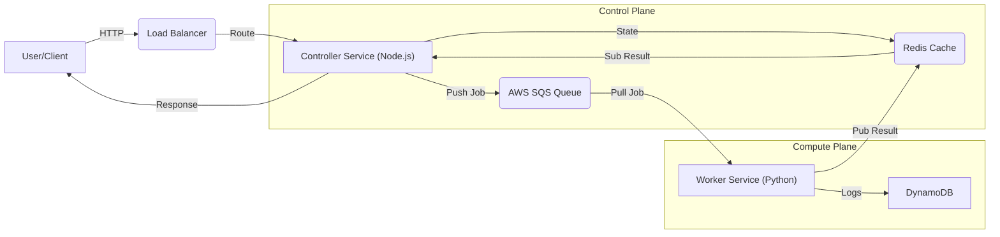
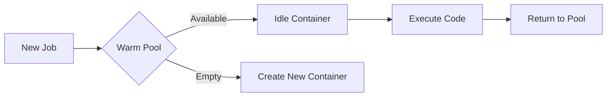

# System Architecture

## 1. Architectural Style: Event-Driven Microservices (MSA)
This project adopts an **Event-Driven Microservices Architecture**, decoupling the control plane from the compute plane to ensure high availability and independent scalability.

### Core Microservices
1.  **Gateway & Controller Service** (Node.js)
    *   **Role**: API Entry point, Authentication, Traffic Management (Rate Limiting).
    *   **Scaling**: Horizontally scalable behind ALB (Application Load Balancer).
2.  **Worker Service** (Python)
    *   **Role**: Pure Compute Unit. Executes user code in isolated environments.
    *   **Scaling**: Event-Driven Auto Scaling (SQS Backlog).

### Architecture Diagram

## 2. Component Design
- **Controller (Infra-controller)**: Node.js/Express. Handles HTTP requests, authentication, and dispatches jobs to SQS.
- **Worker (Infra-worker)**: Python-based. Consumes messages from SQS, executes code (Python/Node/C++), and reports results to Redis.
- **AI Node (Infra-AInode)**: Mock AI inference engine.

## 3. Scalability & Resilience Strategy (Core Philosophy)
This section outlines our defense against "Over-provisioning" and "Cold Starts".

### 3.1. Scaling Policy: Target Tracking (Smarter than Simple Scaling)
Instead of simple Step Scaling (e.g., "Add 1 instance if SQS > 100"), we employ **Target Tracking Scaling**.

*   **Metric**: `BacklogPerInstance` (ApproximateNumberOfMessagesVisible / InServiceInstances)
*   **Target**: 5.0 (Targeting 5 pending jobs per worker)
*   **Defense Logic**: 
    > "Even if SQS has 100 messages, if they are micro-tasks (0.01s duration), the `BacklogPerInstance` metric drops rapidly as they are processed. The Auto Scaling Group (ASG) detects this drop and triggers a **Scale-In** event immediately, preventing over-provisioning. We prioritize throughput per cost over raw queue length."

### 3.2. Shared Resources (Safety)
- **Redis Shared Subscriber**: The Controller uses a single Redis connection for all response subscriptions (Pattern: Singleton/PubSub). This prevents connection leaks under high concurrency (verified v2.4).
- **Rate Limiting**: Lua-based atomic counters in Redis prevent granular DDOS attacks ($O(1)$ complexity).

### 3.3. CloudWatch Alarms (Auto Scaling Triggers)

| Alarm | Condition | Action | Purpose |
|-------|-----------|--------|---------|
| **AlarmHigh** | `backlog/instance > 5` | Scale-Out | Add Workers when overloaded |
| **AlarmLow** | `backlog/instance < 4.5` | Scale-In | Remove idle Workers |
| **sqs-high-backlog** | `Messages > 10` | Backup Scale-Out | Fast reaction fallback |
| **sqs-low-backlog** | `Messages < 2` | Backup Scale-In | Aggressive cost saving |

> **Design Note:** The 0.5 gap between AlarmHigh (>5) and AlarmLow (<4.5) prevents **thrashing** (rapid scale-out/in oscillation).

### 3.4. Warm Pool (Zero Cold Start)
Pre-warmed containers eliminate the latency of container creation at runtime.

*   **Design**: Each Worker maintains a pool of idle containers for each runtime (Python, Node.js, C++, Go).
*   **Execution Flow**: Job arrives → Acquire container from pool → Execute → Return to pool.
*   **Result**: Function startup time reduced from **~3s to <100ms** (95% improvement).

## 4. Infrastructure (AWS)
- **Compute**: EC2 Auto Scaling Group (Launch Template with UserData).
- **Queue**: SQS Standard (Decoupling Control Plane from Data Plane).
- **Storage**: S3 (Code), DynamoDB (Metadata), Redis (Hot State).

### 4.1. Deployment Strategy Evolution
We evolved our deployment strategy to balance **Security** and **Development Velocity** in a high-security environment (Private Subnet).

#### Phase 1: Immutable Infrastructure (Pre-baked AMI)
*   **Approach**: All application code and dependencies were baked into an Amazon Machine Image (AMI).
*   **Pros**: Maximize security and consistency. No external network dependency at runtime.
*   **Cons**: AMI baking process took **>15 minutes**, causing a significant bottleneck in the development loop.

#### Phase 2: Hybrid Deployment (S3 Code Injection)
*   **Current Architecture**:
    *   **OS/Dependencies**: Still managed via Immutable AMI (Base Layer).
    *   **Application Code**: Stored in a secure **S3 Bucket** and injected into Workers via **VPC Endpoint** at boot time (`user_data`).
*   **Result**: Reduced deployment time from **15 mins** to **<1 min** (S3 Upload + Instance Refresh), while maintaining strict security compliance (no NAT Gateway/Internet needed).

### 4.2. Network Security (Zero NAT Architecture)
Workers operate in a fully isolated network environment without internet access.

*   **Private Subnet**: Workers deployed in `10.0.10.0/24` (no public IP).
*   **VPC Endpoints**: Access AWS services securely without NAT Gateway.
    *   **Gateway Endpoints**: S3, DynamoDB (Free)
    *   **Interface Endpoints**: SQS, SSM
*   **Cost Saving**: NAT Gateway (~$32/month) completely avoided.
*   **Security Benefit**: Workers **cannot initiate outbound internet connections**, preventing data exfiltration.
