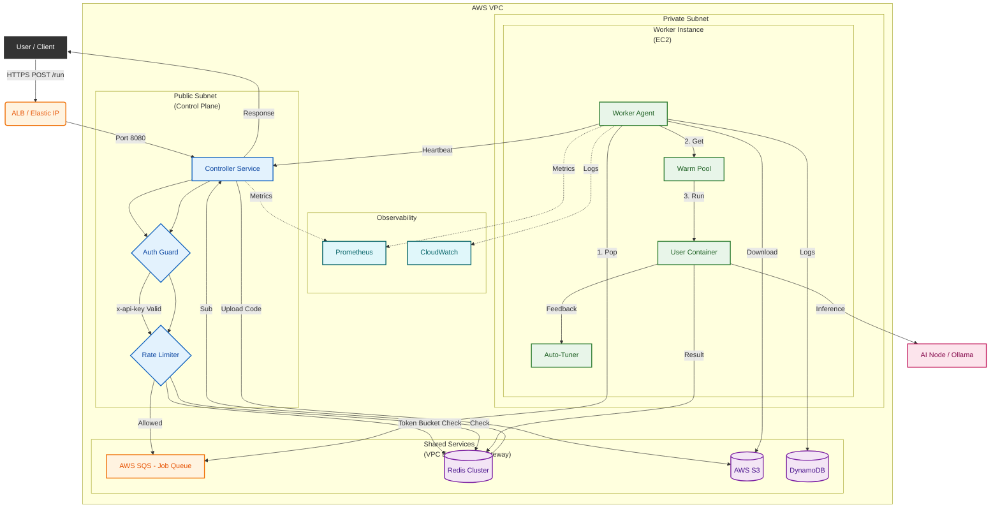

# System Architecture

## 1. Architectural Style: Event-Driven Microservices (MSA)
This project adopts an **Event-Driven Microservices Architecture**, decoupling the control plane from the compute plane to ensure high availability and independent scalability.

### Core Microservices
1.  **Gateway & Controller Service** (Node.js)
    *   **Role**: API Entry point, Authentication, Traffic Management (Rate Limiting).
    *   **Scaling**: Horizontally scalable behind ALB (Application Load Balancer).
2.  **Worker Service** (Python)
    *   **Role**: Pure Compute Unit. Executes user code in isolated environments.
    *   **Scaling**: Event-Driven Auto Scaling (SQS Backlog).

### Architecture Diagram

## 2. Component Design
- **Controller (Infra-controller)**: Node.js/Express. Handles HTTP requests, authentication, and dispatches jobs to SQS.
- **Worker (Infra-worker)**: Python-based. Consumes messages from SQS, executes code (Python/Node/C++), and reports results to Redis.
- **AI Node (Infra-AInode)**: Mock AI inference engine.

## 3. Scalability & Resilience Strategy (Core Philosophy)
This section outlines our defense against "Over-provisioning" and "Cold Starts".

### 3.1. Scaling Policy: Target Tracking (Smarter than Simple Scaling)
Instead of simple Step Scaling (e.g., "Add 1 instance if SQS > 100"), we employ **Target Tracking Scaling**.

*   **Metric**: `BacklogPerInstance` (ApproximateNumberOfMessagesVisible / InServiceInstances)
*   **Target**: 5.0 (Targeting 5 pending jobs per worker)
*   **Defense Logic**: 
    > "Even if SQS has 100 messages, if they are micro-tasks (0.01s duration), the `BacklogPerInstance` metric drops rapidly as they are processed. The Auto Scaling Group (ASG) detects this drop and triggers a **Scale-In** event immediately, preventing over-provisioning. We prioritize throughput per cost over raw queue length."

### 3.2. Shared Resources (Safety)
- **Redis Shared Subscriber**: The Controller uses a single Redis connection for all response subscriptions (Pattern: Singleton/PubSub). This prevents connection leaks under high concurrency (verified v2.4).
- **Rate Limiting**: Lua-based atomic counters in Redis prevent granular DDOS attacks ($O(1)$ complexity).

## 4. Infrastructure (AWS)
- **Compute**: EC2 Auto Scaling Group (Launch Template with UserData).
- **Queue**: SQS Standard (Decoupling Control Plane from Data Plane).
- **Storage**: S3 (Code), DynamoDB (Metadata), Redis (Hot State).
