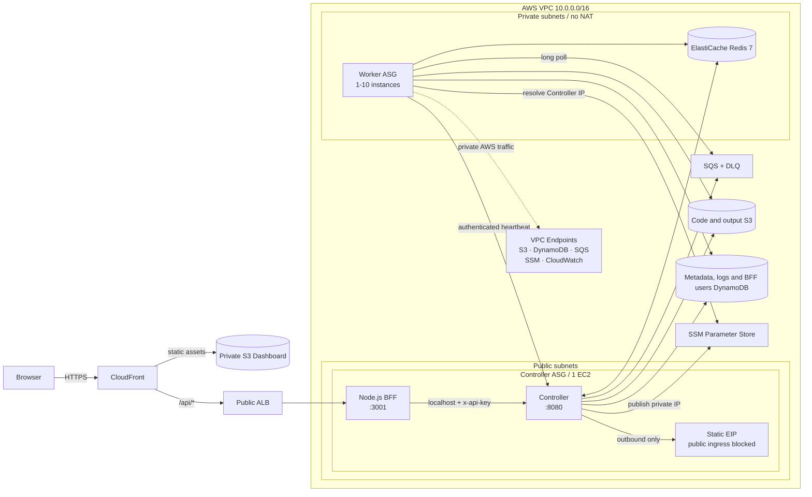
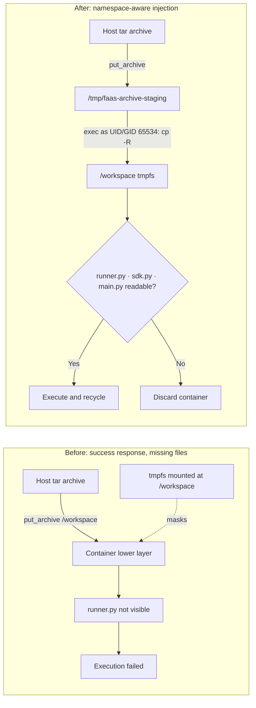
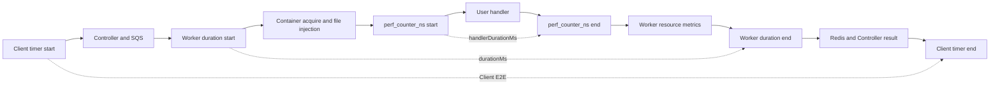
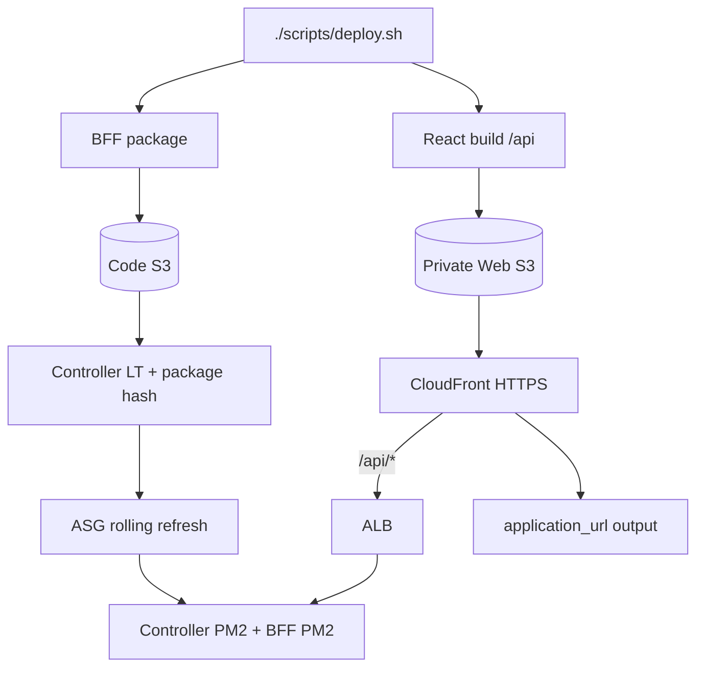
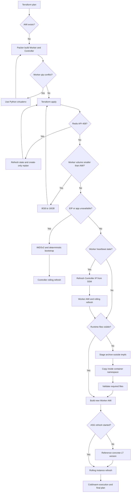
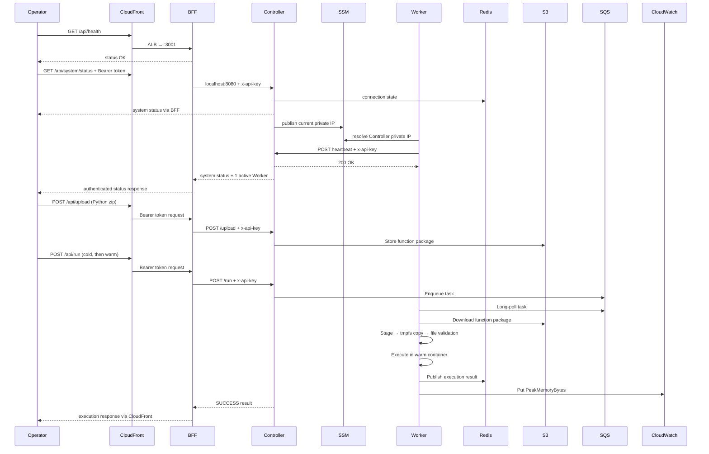

# FaaS Platform 구현 및 배포 보고서

> 기준 시점: 2026-08-08 · 대상 리전: `ap-northeast-2`

이 문서는 프로젝트를 실제로 읽고 검증하면서 수행한 보안·신뢰성 개선, Packer
AMI 제작, Terraform 배포, 장애 진단과 수정 결과를 기록한다. 단순 작업 목록보다
각 변경의 **왜(문제와 목적)**, **무엇을(변경 범위)**, **어떻게(구현과 검증)**에
초점을 둔다.

## 1. 결과 요약

AWS 인프라와 Controller/Worker 런타임, React Dashboard와 self-hosted BFF 배포를
완료했다. Terraform apply로 생성한 managed resource는 71개이며, data source 9개를
포함한 state address는 80개다.
마지막 검증에서 configuration drift는 없었다.

| 항목 | 배포 결과 |
|---|---|
| Controller public ingress | 차단 (`:8080`은 Worker private subnet과 localhost에서만 접근) |
| Public Dashboard | `https://d2jzknz5q7hmdj.cloudfront.net` |
| Web delivery | CloudFront → private S3 / ALB → EC2 BFF |
| BFF health | CloudFront `GET /api/health` → `status: OK` |
| Controller health | 인증된 `GET /api/system/status` → `online` |
| Controller AMI | `ami-0dcd18322b835984c` |
| Worker AMI | `ami-0543c61581143bcfb` |
| Controller ASG | 1대, EIP 자동 연결, rolling refresh 구성 |
| Worker ASG | 1–10대, SQS backlog 기반 확장, rolling refresh 구성 |
| Worker 상태 | 1대 healthy, LT v3, heartbeat 및 runtime pool 확인 |
| Terraform | 71 managed resources, 80 state addresses, no drift |

CloudFront 주소가 유일한 공개 애플리케이션 진입점이다. Controller EIP는 bootstrap과
outbound 통신을 위해 유지하지만 Security Group에서 public `:8080` ingress를 허용하지
않는다. 브라우저는 Bearer token으로 BFF에만 접근하고 BFF가 localhost에서
`x-api-key`를 붙여 Controller를 호출한다.

### 이번 수정 요약

| 왜 | 무엇을 | 어떻게 | 확인 결과 |
|---|---|---|---|
| 업로드 성공 후에도 `runner.py`를 찾지 못함 | Worker 파일 주입과 실행 전 검증 | tmpfs 외부 staging 후 container namespace 내부 복사 | cold/warm 모두 `SUCCESS` |
| 실패한 실행 환경이 warm pool에 남을 수 있음 | 컨테이너 재사용 정책 | 주입·검증·실행 실패 시 즉시 폐기 | 실패 경로 단위 테스트 통과 |
| 실행 metric 전송이 IAM에서 거부됨 | Worker role 권한 | `FaaS/FunctionRunner`에만 `PutMetricData` 허용 | `PeakMemoryBytes` 생성 확인 |
| 새 AMI가 기존 인스턴스를 자동 교체하지 않음 | ASG Launch Template 참조 | `$Latest` 대신 concrete latest version 사용 | rolling refresh 100% 성공 |
| `packer init .`가 template 변수 충돌로 실패 | Packer 실행 문서 | Worker/Controller HCL별로 init | 두 template validate 통과 |
| UI 시간이 handler 실행시간처럼 보임 | 실행 단계별 시간 의미 분리 | `handlerDurationMs`, Worker time, Client E2E 개별 계측 | 0ms/150ms control 오차 범위 확인 |
| 로컬 실행 없이는 Dashboard에 접속할 수 없음 | Web delivery와 BFF 운영 자동화 | CloudFront/S3/ALB, EC2 BFF package rollout, deploy script | 외부 가입·로그인·함수 조회 성공 |

## 2. 현재 아키텍처



CloudFront는 React와 `/api/*`를 단일 HTTPS origin처럼 제공한다. 정적 파일은 public
access가 차단된 S3에 있고, API traffic은 CloudFront origin-facing prefix list만
허용하는 ALB를 거쳐 Controller EC2의 BFF로 전달된다. AWS Lambda는 요청 경로에 없다.

## 3. 왜, 무엇을, 어떻게 변경했는가

### 3.1 Worker 실행 격리

**왜:** 사용자 함수가 Docker에서 실행되므로 host 침해, 과도한 프로세스 생성,
네트워크·파일시스템 오용 가능성을 줄여야 했다.

**무엇을:** 컨테이너 권한, namespace, filesystem, resource limit과 실행 계측을
강화했다.

**어떻게:** UID/GID 65534, capability 제거, `no-new-privileges`, PID 제한,
read-only root filesystem, workspace/output tmpfs, container namespace 내부 파일
주입, Cgroup v2 직접 계측을 적용했다. tmpfs 파일 주입의 세부 보완은 3.10에
기록했다. 관련 핵심 커밋은 `c8a084af`, `d64b0bf2`, `723595a4`다.

### 3.2 Controller 인증과 실행 회계

**왜:** 브라우저에 인프라 API key가 노출되면 전체 Controller 권한이 유출되고,
실행량·duration 집계 오류는 비용 및 관측 결과를 왜곡한다.

**무엇을:** BFF 인증 경계, Controller의 key 검증, Redis rate limit, 실행 결과 집계와
운영 API를 보강했다.

**어떻게:** 브라우저는 Bearer token만 사용하고 BFF만 `INFRA_API_KEY`를 보유하게
했다. Controller는 `x-api-key`를 검증하고 Redis Lua token bucket을 적용한다.
EC2에는 장기 AWS key 대신 instance role을 연결했다. 관련 커밋은 `473ee49d`,
`492893c0`, `f99a1fa9`다.

### 3.3 재현 가능한 AMI

**왜:** Terraform이 참조할 self-owned Worker/Controller AMI가 없어 최초 plan이
실패했고, private Worker는 NAT 없이 부팅되므로 런타임 dependency와 Docker image를
미리 포함해야 했다.

**무엇을:** Worker와 Controller용 Packer template을 모두 마련하고 Amazon Linux
2023으로 통일했다.

**어떻게:** Worker AMI에는 Docker, Python virtualenv, 서비스 unit, Python/Node/C++/Go
runtime image를 포함했다. Controller AMI에는 Node.js 22, PM2, 애플리케이션과
production dependency를 포함했다. Terraform은 `faas-worker*`, `faas-controller*`
중 가장 최근의 self-owned AMI를 선택한다.

```mermaid
flowchart LR
    Source[Repository source] --> Packer[Packer validate/build]
    Packer --> Temp[Temporary EC2]
    Temp --> Provision[Install runtime and copy app]
    Provision --> AMI[Versioned AMI]
    AMI --> Lookup[Terraform data.aws_ami]
    Lookup --> LT[Launch Template new version]
    LT --> Refresh[ASG rolling refresh]
    Refresh --> Verify[Health and heartbeat verification]
```



### 3.4 Python dependency 격리

**왜:** 첫 Worker Packer 빌드에서 OS RPM으로 설치된 `requests`를 pip가 제거하려다
`RECORD file not found` 오류가 발생했다.

**무엇을:** Worker application dependency를 system Python과 분리했다.

**어떻게:** `/home/ec2-user/faas-worker/.venv`를 만들고 requirements를 그 안에
설치했다. systemd `ExecStart`도 virtualenv Python을 사용하도록 변경했다.

### 3.5 Controller dependency 보안

**왜:** 첫 Controller AMI 빌드에서 production dependency 28건 중 critical 1건과
high 1건이 확인됐고 Node.js 18은 지원 종료 상태였다.

**무엇을:** AWS SDK, Express 계열 dependency lockfile과 Node runtime을 갱신했다.

**어떻게:** 호환 범위의 `npm audit fix --omit=dev`를 적용해 critical/high를 제거하고
Node.js 22로 올렸다. 강제 major update가 필요한 `uuid` moderate 1건은 실제 사용
API와 호환성 검토가 필요해 남겼다. 관련 커밋은 `8b1d19cf`다.

### 3.6 Terraform 인프라 배포

**왜:** AMI만으로는 network, queue, storage, IAM, scaling과 복구 정책이 생성되지
않는다.

**무엇을:** VPC, public/private subnet, endpoint, Redis, SQS/DLQ, S3, DynamoDB,
IAM role, Launch Template, ASG, CloudWatch alarm을 Terraform으로 생성했다.

**어떻게:** 매 적용 전 저장된 plan의 create/update/destroy 수를 확인했다. 최초
계획은 `56 add / 0 change / 0 destroy`였고, 부분 실패 후에는 state를 refresh한 새
plan만 적용했다. 최종 plan은 no-op이다.

### 3.7 Controller self-healing bootstrap

**왜:** Controller ASG가 EC2 health만 만족해도 application과 EIP가 준비되지 않을 수
있다. 실제 첫 인스턴스는 EIP를 연결하지 못해 공개 endpoint가 timeout됐다.

**무엇을:** IMDSv2 기반 metadata 조회, deterministic dependency 설치, EIP 재연결,
SSM private IP 게시와 rolling refresh를 구현했다.

**어떻게:** IMDS token을 먼저 발급받아 instance/private IP를 조회하고,
`npm ci --omit=dev` 후 PM2로 Controller를 시작한다. Launch Template 변경 시 ASG
rolling refresh를 사용한다. 관련 커밋은 `fec12063`, `8ebde448`다.

### 3.8 Controller 교체 후 Worker 복구

**왜:** Worker가 부팅 시 읽은 Controller private IP를 계속 보관해 Controller가
교체되면 heartbeat가 이전 IP로 전송됐다.

**무엇을:** heartbeat 연결 실패 시 Controller endpoint를 다시 찾도록 변경했다.

**어떻게:** Worker는 `URLError` 발생 시 `/faas/controller/private_ip` SSM parameter를
다시 읽고 다음 heartbeat부터 새 주소를 사용한다. Controller 교체 후 Worker가 별도
재부팅 없이 다시 `healthy`로 등록되는 것을 확인했다. 관련 커밋은 `d28b11d9`다.

### 3.9 API 루트 응답

**왜:** API가 정상이어도 `/` route가 없으면 Express 기본 응답 `Cannot GET /`가
나와 배포 실패처럼 보였다.

**무엇을:** 공개 API discovery endpoint를 추가했다.

**어떻게:** `GET /`가 service, version, health 상태, 주요 endpoint와 인증 요구사항을
JSON으로 반환한다. 현재 인스턴스에 즉시 반영한 뒤 새 Controller AMI를 만들어
ASG 교체 후에도 같은 응답을 확인했다. 관련 커밋은 `75c3ba86`다.

### 3.10 Worker tmpfs 파일 주입 장애

**왜:** 함수 업로드와 task 전달은 성공했지만 실행 결과가
`python: can't open file '/workspace/runner.py'`로 실패했다. Worker 로그에는 파일
3개를 주입했다고 기록됐으므로, 성공 여부만 확인하는 기존 로직으로는 실제 실행
공간에 파일이 보이는지 보장할 수 없었다.

**무엇을:** 컨테이너 파일 주입 경로, 실행 전 검증, 실패 컨테이너의 재사용 정책을
수정했다. Worker가 CloudWatch custom metric을 전송할 수 있도록 IAM 권한도
`FaaS/FunctionRunner` namespace로 제한해 추가했다.

**어떻게:** Docker `put_archive('/workspace', ...)`는 성공을 반환했지만
`/workspace`가 tmpfs mount라 archive가 기록된 container lower layer를 가렸다.
따라서 archive를 먼저 일반 root filesystem의 `/tmp/faas-archive-staging`에 풀고,
컨테이너 namespace 안에서 비특권 사용자로 `cp -R`하여 tmpfs에 기록한다. 이후
`runner.py`, `sdk.py`, `main.py`를 실제로 읽을 수 있는지 검사하며, 어느 단계든
실패한 컨테이너는 warm pool로 반환하지 않고 폐기한다.



관련 커밋은 `d64b0bf2`, `723595a4`, `666f2ac0`다. Worker 단위 테스트 11개와
실제 Python 함수의 cold/warm 실행을 통과했고, 같은 function dimension의
CloudWatch `PeakMemoryBytes` metric 생성을 확인했다.

### 3.11 AMI 변경의 자동 롤링 배포

**왜:** 새 AMI로 Launch Template version 2가 생성돼도 ASG 설정이 문자열
`$Latest`를 계속 참조하면 Terraform diff에는 Launch Template 변경만 나타나고
instance refresh가 시작되지 않았다. 즉 설정은 최신 이미지를 가리키지만 실행 중인
인스턴스는 이전 이미지에 남을 수 있었다.

**무엇을:** Worker ASG가 Launch Template의 구체적인 최신 version 값을 참조하도록
변경했다.

**어떻게:** `version = aws_launch_template.worker.latest_version`으로 의존성을
명시했다. 이후 AMI 변경은 `AMI → Launch Template version → ASG diff → rolling
refresh`로 전파된다. 이번 배포에서는 refresh
`be9bd915-d6dd-47d3-9dcb-2c784a155a83`가 100% 성공했고 새 Worker가 version 2로
InService 상태가 됐다. 관련 커밋은 `b081bc09`다.

```mermaid
flowchart LR
    Code[Fixed Worker source] --> Packer[Packer build]
    Packer --> AMI["Worker AMI\nami-0543c61581143bcfb"]
    AMI --> Data[Terraform latest self-owned AMI lookup]
    Data --> LT[Launch Template version 2]
    LT --> ASG[ASG version diff]
    ASG --> Roll[Rolling instance refresh]
    Roll --> Heartbeat[Healthy Worker heartbeat]
    Heartbeat --> E2E[Cold and warm E2E]
```



### 3.12 사용자 handler 순수 실행시간 계측

**왜:** 기존 `durationMs`는 Worker가 task 처리를 시작한 시점부터 컨테이너 획득,
파일 주입, Docker exec, 함수 실행과 resource metric 조회까지 포함한다. UI가 이를
`Response Time`으로 표시해 사용자 handler의 순수 실행시간이나 client end-to-end
latency로 오해할 수 있었다.

**무엇을:** 한 번의 실행에서 서로 다른 세 시간축을 분리했다.

| 필드 | 측정 위치 | 포함 범위 |
|---|---|---|
| `handlerDurationMs` | Python `runner.py` | `handler(event, context)` 호출만 |
| `durationMs` | Worker `Executor.run()` | Worker orchestration과 함수 실행 |
| Client E2E | React test client | BFF/Controller/SQS/Worker 왕복 전체 |

**어떻게:** `runner.py`가 `perf_counter_ns()`로 handler 호출 전후를 측정하고
platform 전용 JSON 파일에 nanosecond 값을 기록한다. `/output`도 tmpfs이므로
Worker는 container namespace 안에서 결과를 일반 root filesystem staging 경로로
복사한 후 Docker archive API로 회수한다. 예약 파일은 `handlerDurationMs`로 변환한
직후 삭제해 사용자 output 목록과 S3 upload에는 포함하지 않는다. Controller는
실행 log와 `function_handler_duration_seconds` Prometheus histogram에 별도로
저장하고, UI는 Handler Time, Worker Processing, Client E2E를 각각 표시한다.



계측 자체를 검증하기 위해 같은 함수에 0ms와 150ms의 의도적 delay를 주었다. 0ms
handler는 `0.002–0.004ms`, 150ms handler는 `150.211–150.256ms`로 보고돼 timer가
Worker orchestration 시간이 아니라 handler 구간만 측정함을 확인했다.

### 3.13 공개 Dashboard와 self-hosted BFF 원클릭 배포

**왜:** 기존에는 Controller와 Worker만 Terraform으로 생성되어 사용자가 Dashboard를
보려면 노트북에서 `npm run dev`를 직접 실행해야 했다. CloudFront hostname과
Controller 주소는 destroy 후 재생성할 때 달라질 수 있어 수동 URL 설정도 재현성을
떨어뜨렸다. 또한 핵심 FaaS 구현을 강조하는 포트폴리오에서 BFF를 AWS Lambda로
운영하면 관리형 FaaS와 직접 구현한 실행 plane의 경계가 불필요하게 흐려진다.

**무엇을:** React 정적 배포, Node.js BFF 운영, 사용자 저장소와 외부 HTTPS 진입점을
Terraform 범위에 포함했다. BFF는 별도 Lambda나 EC2를 만들지 않고 기존 Controller
ASG 인스턴스의 독립 PM2 process로 실행한다.

**어떻게:** `scripts/deploy.sh`가 lockfile 기반 dependency 설치, React build,
BFF package 생성을 수행한다. Terraform은 package를 code S3 bucket에 올리고 package
hash를 Controller Launch Template user data에 포함한다. 변경된 LT version이 ASG
rolling refresh를 시작하면 새 인스턴스가 package를 내려받아 `faas-bff`를 3001번
port에서 실행한다. CloudFront는 `/`를 private S3로, `/api/*`를 ALB로 분기한다.
ALB ingress는 AWS-managed CloudFront origin-facing prefix list로 제한한다. BFF는
Controller를 `127.0.0.1:8080`으로 호출하며 배포 환경의 사용자는 on-demand DynamoDB에
저장한다.

Controller EIP의 `:8080`은 공개하지 않는다. Worker heartbeat는 private subnet CIDR
규칙으로 유지되고 BFF는 loopback을 사용하므로 이 제한은 함수 배포·실행에 영향을
주지 않는다. EIP는 Controller bootstrap의 인터넷 접근과 ASG 교체 후 안정적인
outbound identity를 위해 남긴다.



실제 배포에서 Controller refresh `d92aac7b-9000-48af-b1d1-42ed565a6074`가 100%로
완료됐고 ALB target `i-08ec431a1f51e619a`가 `healthy`가 됐다. CloudFront 외부 주소로
SPA route, `/api/health`, 회원가입, 로그인, Bearer token 기반 `/api/functions` 조회를
검증했으며 테스트 사용자는 검증 후 DynamoDB에서 제거했다.

## 4. 배포 중 발견한 문제와 해결 흐름



| 증상 | 원인 | 해결 | 검증 |
|---|---|---|---|
| Terraform AMI lookup 실패 | self-owned AMI 부재 | 두 Packer builder 추가 | 최신 AMI ID 조회 성공 |
| Worker Packer pip 실패 | RPM package와 pip 충돌 | virtualenv 설치 | Worker AMI build 성공 |
| Redis 생성 408 | AWS 일시 오류 | state refresh 후 create-only 재시도 | Redis 7 endpoint 생성 |
| Worker ASG 생성 거부 | 16GB snapshot에 8GB LT volume | LT volume 16GB | Worker ASG InService |
| EIP 미연결 | IMDSv1 metadata 조회 실패 | IMDSv2 token 사용 | EIP association 확인 |
| Controller cloud-init 실패 | `$HOME` 없는 root에서 global git config | baked app 우선, `npm ci` | cloud-init `done`, PM2 online |
| Worker heartbeat 실패 | 교체 전 private IP 고정 | SSM endpoint 재조회 | Worker registry healthy |
| `Cannot GET /` | Express root route 부재 | discovery route 추가 | 새 AMI 교체 후 JSON 응답 |
| `/workspace/runner.py` 없음 | archive가 tmpfs 아래 lower layer에 기록됨 | staging 후 namespace 내부 복사 | cold/warm 함수 `SUCCESS` |
| CloudWatch `AccessDenied` | Worker role에 custom metric 권한 없음 | namespace 제한 `PutMetricData` 허용 | `PeakMemoryBytes` 조회 성공 |
| 새 AMI인데 기존 Worker 유지 | ASG가 문자열 `$Latest`를 참조 | 구체적인 LT version 참조 | instance refresh 100% 성공 |

## 5. 최종 검증



| 검증 | 결과 |
|---|---|
| Packer validate | Worker/Controller 모두 통과 |
| Packer build | 두 최신 AMI 모두 `available` |
| Terraform validate | 통과 |
| Terraform apply | 완료, destroy 없음 |
| Post-deploy plan | No changes |
| Controller PM2 | online |
| Controller public `:8080` | Security Group에서 차단 |
| Controller health | 인증된 BFF `/api/system/status` 경유 확인 |
| Worker systemd | active |
| Worker runtime images | Python, Node.js, GCC, Go ready |
| Redis/SQS Worker 연결 | 연결 및 polling 확인 |
| Worker heartbeat | 1 healthy Worker |
| Controller/Worker refresh | 각 100% successful |
| Public Dashboard | CloudFront HTTPS에서 `/`와 SPA route 200 |
| Self-hosted BFF | ALB target healthy, `/api/health` 200 |
| Authentication E2E | 가입·로그인·Bearer token 함수 목록 조회 성공 |
| Managed FaaS dependency | Lambda/API Gateway 제거 확인 |
| Worker tests | 15개 통과 |
| Python cold execution | `SUCCESS`, exit 0, Worker 보고 `durationMs: 1,402` |
| Python warm execution | `SUCCESS`, exit 0, Worker 보고 `durationMs: 743` |
| Runtime file injection | `runner.py`, `sdk.py`, `main.py` readable |
| CloudWatch custom metric | `PeakMemoryBytes`, function/runtime dimension 확인 |
| Worker AMI rollout | LT v3, instance refresh 검증 완료 |
| Controller AMI rollout | LT v2, instance refresh 100% successful |
| Handler timer, 0ms control | `0.002–0.004ms` |
| Handler timer, 150ms control | `150.211–150.256ms` |

여기서 `durationMs`는 외부 부하 도구로 측정한 client end-to-end latency가 아니다.
Worker의 `Executor.run()`이 처리 시작 시각부터 컨테이너 획득, workspace 준비와 파일
주입, 사용자 함수 실행, 실행 직후 resource metric 조회까지 측정해 응답에 넣은
wall-clock 값이다. Controller 왕복 네트워크, SQS에서 task가 선택되기 전 대기,
Redis를 통한 결과 반환 등 전체 사용자 체감 구간은 별도로 측정하지 않았다.

## 6. 커밋 구성

변경 목적별로 커밋을 분리했다.

| Commit | 목적 |
|---|---|
| `c8a084af` | Worker container isolation 강화 |
| `473ee49d` | Controller 운영·실행 회계 보강 |
| `492893c0` | static AWS credential을 instance role로 교체 |
| `f99a1fa9` | BFF 인증 경계와 browser secret 제거 |
| `311d9483` | 보안·신뢰성 문서화 |
| `420c4fdb` | README를 구현과 정렬 |
| `602e6cb9` | Terraform provider lock 초기화 |
| `8b1d19cf` | Controller runtime dependency 보안 업데이트 |
| `3c16b220` | Controller/Worker Packer builder 추가 |
| `7b8c835c` | Worker AMI와 LT volume 크기 정합화 |
| `fec12063` | Controller IMDSv2 bootstrap 적용 |
| `8ebde448` | Controller bootstrap 재현성 확보 |
| `d28b11d9` | Worker의 Controller endpoint 자동 갱신 |
| `9e9b1d4e` | Worker rolling refresh 구성 |
| `75c3ba86` | Controller root discovery endpoint 추가 |
| `d64b0bf2` | Worker 파일 주입 검증과 실패 컨테이너 폐기 |
| `666f2ac0` | Worker CloudWatch custom metric IAM 권한 추가 |
| `723595a4` | tmpfs 외부 staging 후 namespace 내부 파일 복사 |
| `b081bc09` | Launch Template version 변경 시 Worker rolling refresh 보장 |
| `4ceee2b3` | Worker/Controller별 Packer 초기화 명령 수정 |
| `7723c9f6` | 순수 handler 계측과 tmpfs output 회수 구현 |
| `0fa510c5` | Controller handler metric 저장·집계와 rolling refresh 보장 |
| `295d5db8` | UI에서 Handler/Worker/Client E2E 시간 분리 |

## 7. 운영 방법

### 상태 확인

```bash
curl https://d2jzknz5q7hmdj.cloudfront.net/api/health

cd Infra-terraform
terraform plan -detailed-exitcode
```

Controller EIP의 `:8080`은 공개 접근할 수 없다. 보호된 endpoint는 CloudFront/BFF를
통해 Bearer token으로 호출하며, 인프라 API key는 shell history나 문서에 직접
기록하지 않는다.

### 이미지 갱신

```bash
cd Infra-packer
packer init worker-ami.pkr.hcl
packer validate worker-ami.pkr.hcl
packer build worker-ami.pkr.hcl
packer init controller-ami.pkr.hcl
packer validate controller-ami.pkr.hcl
packer build controller-ami.pkr.hcl

cd ../Infra-terraform
terraform plan
terraform apply
```

새 Launch Template version 적용 후 ASG instance refresh 상태와 `/health`, Worker
heartbeat를 함께 확인한다.

## 8. 남은 작업

### 우선순위 P0 — 공개 운영 전 필수

1. 고정 URL이 필요하면 CloudFront에 정식 도메인, Route 53과 ACM certificate를 연결한다.
2. AWS root credential 대신 최소 권한 IAM/SSO 또는 CI OIDC role로 배포한다.
3. Terraform local state를 암호화·잠금 가능한 remote backend로 이전한다.
4. API key와 BFF secret을 Secrets Manager/Parameter Store SecureString으로 이전하고
   rotation 절차를 만든다.

### 우선순위 P1 — 신뢰성과 운영성

1. ASG health를 EC2 상태가 아니라 application health와 연결한다.
2. 단일 Controller를 ALB 뒤 다중 AZ 구조로 확장하거나 현재 단일 장애 복구 모델을
   운영 요구사항으로 명시한다.
3. CloudWatch Logs/Prometheus/Grafana 수집, dashboard와 alert를 Terraform으로 만든다.
4. AMI lifecycle 정책을 추가하고 이번 작업 중 생성된 이전 AMI와 snapshot을 확인 후
   정리한다.
5. BFF를 Controller와 독립적으로 확장해야 할 시점에 별도 ASG로 분리한다.

### 우선순위 P2 — 기술 부채

1. Worker host Python 3.9를 지원되는 버전으로 올린다.
2. 함수 runtime image의 Node.js 18, Go 1.19를 지원 버전으로 갱신한다.
3. `uuid` major upgrade와 Multer 2 전환의 호환성을 검증해 남은 dependency 경고를
   제거한다.
4. Packer에서 package/runtime version과 source AMI를 pin하고 자동 보안 rebuild를
   구성한다.
5. API discovery에 OpenAPI 문서 링크 또는 `/docs`를 연결한다.

## 9. 범위와 해석

- 이 배포는 Controller, Worker, React Dashboard와 self-hosted BFF를 포함한다.
- Dashboard/BFF delivery에는 CloudFront, private S3와 ALB를 사용하며 Lambda는 사용하지 않는다.
- README의 성능·비용 수치는 별도 직접 측정 결과이며 이번 배포 과정에서 재측정하지
  않았다.
- AMI ID, EIP, resource name은 이 배포 시점의 snapshot이며 이후 배포에서 바뀔 수
  있다. 변동 가능한 값의 기준은 항상 `terraform output`과 AWS 조회 결과다.
