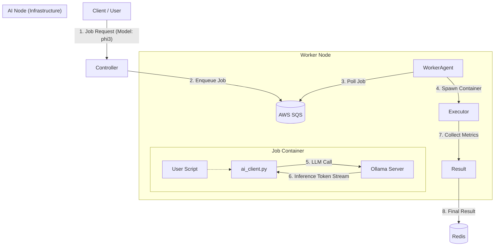

# 🧠 Infra AI Node

<div align="center">


**Dedicated Inference Backend for Dynamic Model Selection & Metering**

</div>

---

## 📖 Introduction

Infra AI Node is not just a simple LLM inference server; it is an intelligent computing node featuring **Dynamic Model Selection**, a **Developer-Friendly SDK**, and **Precise Usage Metering**, designed to seamlessly support Worker Agents executing code.

---

## 🏗️ Architecture

The AI Node efficiently mediates LLM requests between the **Controller** and **Worker Nodes**.



---

## ✨ Key Features

### 1. 🔀 Dynamic Model Selection
Overcoming the limitation of hardcoded single models, users can choose the optimal model for their specific task.
- **Controller API**: `GET /models` to see available models (e.g., `llama3:8b`, `gemma:7b`, `phi3:mini`) in real-time.
- **Per-Job Specification**: Specify `modelId` when submitting a job, and the Worker executes code within that model's context.

### 2. 🛠️ Worker-Specific AI SDK (`ai_client.py`)
No need to implement complex HTTP requests. Use the automatically injected Python SDK to call LLM functions intuitively.
- **Zero-Setup**: No library installation required (auto-injected).
- **Simple API**: Access all features via `generate()` and `chat()`.
- **Resilience**: Built-in automatic retry logic for connection failures.

### 3. 💰 Usage Metering & Functionality
Supports precise usage tracking for a "Pay-per-Token" model.
- **Token Tracking**: Separately tracks Prompt and Generation tokens.
- **Thread-safe**: Reliable logging even in parallel environments (`.jsonl`).
- **Cost Visibility**: Total token usage (`llm_token_count`) included in the execution result (`ExecutionResult`).

---

## 🚀 Getting Started

### Prerequisites
- **Node.js** v18+ (Controller)
- **Python** 3.9+ (Worker)
- **Docker** (Worker Environment)
- **Ollama** (AI Node Backend)
- **AWS Account** (SQS, DynamoDB, S3)

### Installation & Run

#### 1. Run Controller
```bash
cd Infra-AInode
npm install
npm start
# Server running on http://localhost:8080
```

#### 2. Run Worker Agent
```bash
# Setup Venv
python -m venv venv
source venv/bin/activate
pip install -r requirements.txt

# Start Agent
python agent.py
```

---

## 📖 API Reference (Controller)

### List Models
`GET /models`
Returns list of available models from AI Node. (2s timeout)

**Response:**
```json
{
  "models": [
    { "id": "llama3:8b", "name": "llama3:8b", "size": 4661224676, "status": "available" },
    { "id": "phi3:mini", "name": "phi3:mini", "size": 2393288892, "status": "available" }
  ]
}
```

### Run Job
`POST /run`
Submit a job queue item with `modelId`.

**Request:**
```json
{
  "functionId": "func-123",
  "modelId": "phi3:mini",
  "inputData": { "prompt": "Write a Fibonacci sequence function" }
}
```

---

## 💻 SDK Usage Guide (User Script)

Import `ai_client` directly in your Python script (`main.py`).

```python
import ai_client

def main():
    # 1. Text Generation
    summary = ai_client.generate("Summarize this code: print('Hello')")
    print(f"Summary: {summary}")

    # 2. Chat (Override Model)
    response = ai_client.chat(
        messages=[
            {"role": "system", "content": "You are a coding tutor."},
            {"role": "user", "content": "What is recursion?"}
        ],
        model="llama3:8b" # Force specific model for this call
    )
    print(f"Tutor: {response}")

if __name__ == "__main__":
    main()
```

---

## ⚙️ Configuration

| Service | Variable | Description | Default |
| :--- | :--- | :--- | :--- |
| **Common** | `AWS_REGION` | AWS Region | `ap-northeast-2` |
| **Controller** | `AI_NODE_URL` | Ollama Server URL | `http://10.0.20.100:11434` |
| **Controller** | `AI_NODE_TIMEOUT` | Model List Timeout (ms) | `2000` |
| **Worker** | `AI_ENDPOINT` | Internal AI Node Address | `http://10.0.20.100:11434` |

---

<div align="center">
  <sub>Built with ❤️ by Softbank-Final Team</sub>
</div>
