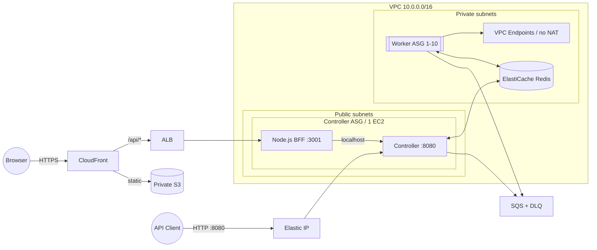

# ☁️ Infra-terraform

<div align="center">


**Infrastructure as Code (IaC) for High-Performance FaaS Platform**

*Public Dashboard • Self-Hosted BFF • Auto-Healing Controller • Backlog-Based Auto Scaling*

</div>

---

## 📖 Introduction

This repository defines the complete AWS infrastructure for the FaaS platform using **Terraform**. It deploys a cost-optimized, secure, and auto-scalable environment where:
- **Workers** run securely in **Private Subnets** without expensive NAT Gateways, using **VPC Endpoints** for AWS services.
- **Controller** utilizes an **Auto Scaling Group (ASG)** + **Elastic IP** pattern for self-healing high availability.
- **Auto Scaling** is driven by real-time SQS queue depth interpretation (Backlog per Instance).
- **React and BFF delivery** uses CloudFront, a private S3 origin, and an ALB in front of the BFF process hosted on the Controller EC2 instance.

---

## 🏗️ Architecture

The infrastructure mimics a production-grade environment with strict network isolation.



---

## ⚡ Key Infrastructure Features

### 1. 🛡️ Secure & Cost-Effective Networking
- **Private Workers**: Worker nodes reside in private subnets with **no direct internet access**.
- **Zero NAT Gateway**: Instead of paying hourly for NAT (`~$32/mo`), we utilize **VPC Endpoints** (Gateway for S3/DynamoDB is free) to securely access AWS services.
- **Security Groups**: Granular control allowing only necessary traffic (e.g., Redis port 6379 only from Controller/Worker).

### 2. 🧠 Intelligent Auto Scaling
- **Metric**: `SQS Backlog Per Instance` (QueueDepth / TotalWorkers).
- **Policy**: Target Tracking Scaling.
    - **Target**: **5.0** messages per worker.
    - If backlog > 5, it scales OUT.
    - If backlog < 5, it scales IN.
- **Warm Pools**: Pre-provisioned capacity ensures rapid scaling responsiveness.

### 3. 🏥 Self-Healing Controller
- **Design**: Controller is a single-instance ASG (Min=1, Max=1).
- **Recovery**: If the Controller crashes, ASG automatically terminates and replaces it.
- **State Preservation**: On boot, the user_data script automatically re-attaches the static **Elastic IP**, ensuring the API endpoint remains constant.

---

## 📦 Resource Inventory

| Category | Resource Type | Name Prefix | Description |
| :--- | :--- | :--- | :--- |
| **Compute** | `aws_autoscaling_group` | `faas-worker-asg` | Dynamic fleet of execution agents. |
| | `aws_launch_template` | `faas-controller` | Template for orchestrator node. |
| **Web** | `aws_cloudfront_distribution` | `faas-sooming dashboard` | Public HTTPS and path routing. |
| | `aws_lb` | `faas-sooming-bff` | CloudFront-only origin for the EC2 BFF. |
| | `aws_s3_bucket` | `faas-sooming-web-*` | Private React build origin. |
| **Storage** | `aws_s3_bucket` | `faas-code-...` | Stores user function code ZIPs. |
| | `aws_dynamodb_table` | `*-table`, `*-logs` | Metadata and Execution Logs (TTL enabled). |
| **Messaging** | `aws_sqs_queue` | `faas-queue` | Main task distribution queue (VisTimeout: 5m). |
| **Cache** | `aws_elasticache_cluster` | `faas-redis` | Redis 7.0 for rate limiting & pub/sub. |
| **Network** | `aws_vpc_endpoint` | `s3`, `dynamodb` | Private connectivity (Gateway Type). |

---

## 🚀 Deployment Guide

### Prerequisites
- Terraform v1.0+
- AWS CLI (`aws configure` verified)
- SSH Key Pair (`faas-key-v2.pem` generated locally)

### One-command deployment

Run from the repository root. The wrapper builds the application artifact before
Terraform evaluates `web.tf`, then publishes React and verifies the public BFF.

```bash
./scripts/deploy.sh
```

The final line prints `application_url`. Existing `faas-controller*` and `faas-worker*`
Packer AMIs are reused.

### Destruction

```bash
./scripts/destroy.sh
```

Terraform does not manage Packer AMIs or their EBS snapshots, so they remain available
for the next deployment.

### Verification

```bash
terraform -chdir=Infra-terraform output -raw application_url
curl "$(terraform -chdir=Infra-terraform output -raw application_url)/api/health"
```

---

## ⚙️ Configuration Variables (`variables.tf`)

| Variable | Default | Description |
| :--- | :--- | :--- |
| `aws_region` | `ap-northeast-2` | Target deployment region. |
| `project_name` | `faas-sooming` | Prefix for all resources. |
| `warm_pool_python_size` | `5` | Number of pre-warmed containers per worker. |
| `instance_type` | `t3.micro` | Instance size for cost efficiency. |

---

<div align="center">
  <sub>Infrastructure Optimized for Serverless Performance</sub>
</div>
