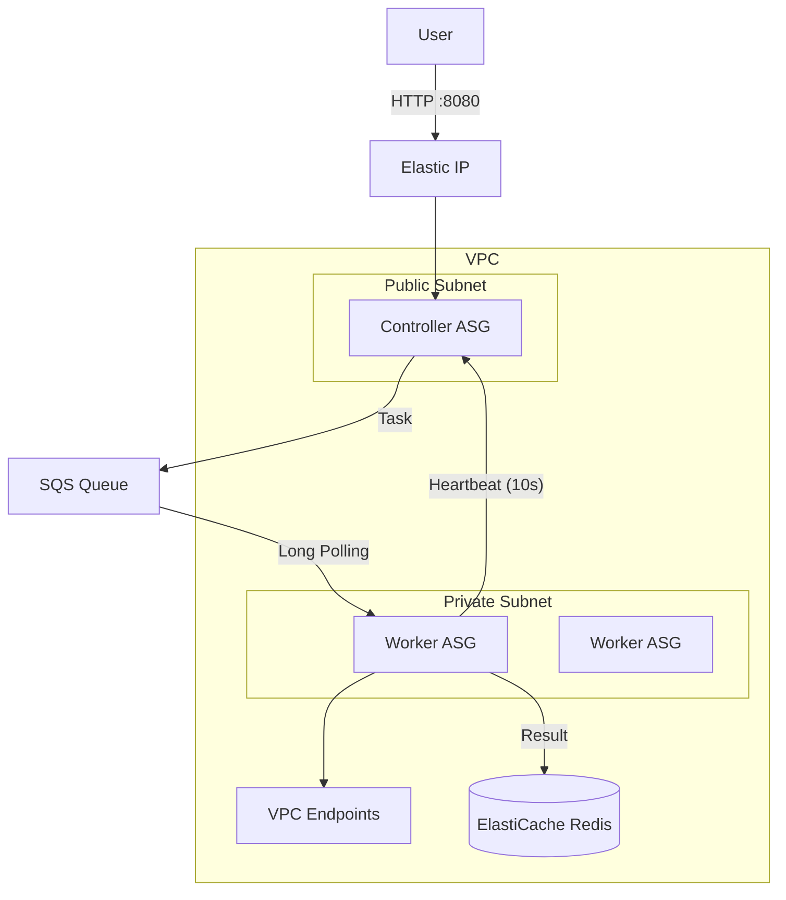

# 🚀 FaaS Platform (Cost-Optimized HA) Update Report

## 📅 Date: 2026-01-05
## 📝 Summary
Successfully refactored the FaaS infrastructure to a **Cost-Optimized High Availability (HA)** architecture. Removed expensive components (NAT Gateway, ALB) while maintaining reliability through Auto Scaling Groups (ASG) and custom application logic. Achieved enterprise-grade features (Logging, Recovery) with minimal cost.

---

## 🏗️ Architecture Overview

### Before vs After
| Component | Previous (Standard) | **Current (Cost-Optimized)** | Benefit |
|-----------|---------------------|------------------------------|---------|
| **Network** | Public/Private + NAT GW | Public/Private + **VPC Endpoints** | **Saved $32/mo** |
| **Load Balancer** | UDP/TCP LB | **Worker Heartbeat Push** | **Saved $20/mo** |
| **Controller** | Single EC2 | **ASG (min=1) + Elastic IP** | Auto Recovery (HA) |
| **Worker** | Public Subnet | **Private Subnet** | Enhanced Security |
| **Boot Time** | ~3 mins (User Data) | **~30 secs (Pre-baked AMI)** | Fast Recovery |

### Diagram


---

## 🛠️ Key Implementation Details

### 1. Networking & Security
- **VPC Design:**
  - IPv4 CIDR: `10.0.0.0/16`
  - **Public Subnets:** For Controller only.
  - **Private Subnets:** For Workers (Internet access blocked, only VPC Endpoints allowed).
- **VPC Endpoints:** Created Interface/Gateway endpoints for S3, DynamoDB, and SQS to allow private workers to access AWS services without NAT.

### 2. High Availability (Controller)
- **Problem:** Single Controller failure stops the entire service.
- **Solution:** 
  - Used **Auto Scaling Group (min=1, max=1)**.
  - If Controller fails, ASG launches a replacement automatically.
  - **Self-Healing IP:** New instance automatically runs `aws ec2 associate-address` to attach the static Elastic IP (`13.209.30.223`) on boot.

### 3. Worker Health Checks (NAT-Free)
- **Problem:** ALB Health Check costs money; NAT Gateway is expensive for Workers to "phone home".
- **Solution: Heartbeat Push Pattern**
  - Worker sends `POST /api/worker/heartbeat` to Controller every 10 seconds.
  - Controller maintains an in-memory registry.
  - If no heartbeat for 30s, Worker is marked "Dead" and removed.

### 4. Production Readiness
- **CloudWatch Logs:** Installed agent to stream logs (`/faas/controller`) for persistency even after instance termination.
- **Pre-baked AMI:** Created a custom AMI (`faas-controller-v1`) with Node.js/PM2 pre-installed. Reduced recovery time from minutes to seconds.

---

## 💰 Cost Analysis (Monthly Estimate)

| Item | Standard Arch | **Current Arch** |
|------|:-------------:|:----------------:|
| EC2 (t3.micro x 2) | $16 | $16 |
| NAT Gateway | $32 | **$0** |
| ALB | $20 | **$0** |
| VPC Endpoints | $0 | ~$7 (SQS only) |
| Elastic IP | $0 | $0 |
| **Total** | **$68** | **~$23** |
| **Savings** | | **📉 -66%** |

---

## 🚨 Troubleshooting & Operations

### Deployment
To deploy updates, update the code in `Infra-terraform` and run:
```bash
terraform apply -auto-approve
```

### Logs
System logs are centralied in CloudWatch.
- **Log Group:** `/faas/controller`
- **Metric Filter:** Can be added for "Error" count.

### Known Issues
- **EIP Association:** When creating a new AMI from an instance that already ran cloud-init, you must run `rm -rf /var/lib/cloud/*` before creating the image. Otherwise, User Data won't run on new instances (Fixed manually this time).
