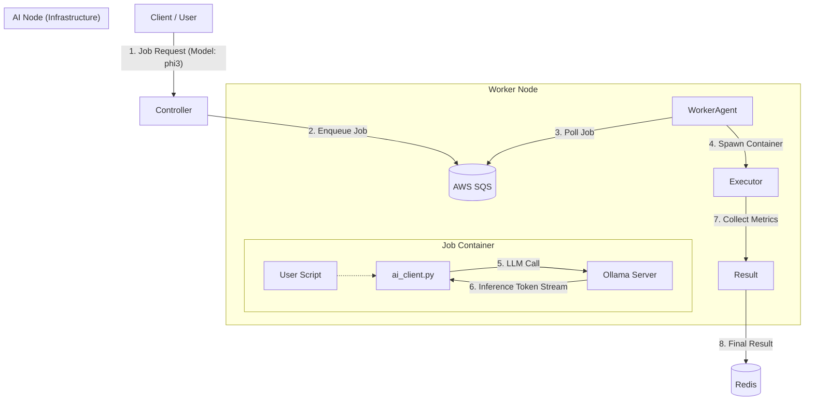

# 🧠 Infra AI Node

> **Worker Agent가 코드를 실행하는 동안 대규모 언어 모델(LLM)을 원활하게 활용할 수 있도록 지원하는 전용 백엔드 인프라입니다.**

Infra AI Node는 단순한 LLM 추론 서버를 넘어, **동적 모델 선택(Dynamic Model Selection)**, **개발자 친화적 SDK**, 그리고 **정밀한 비용 미터링(Metering)** 기능을 갖춘 지능형 컴퓨팅 노드입니다.

---

## 🏗️ 아키텍처 (Architecture)

AI Node는 **Controller**와 **Worker** 사이에서 LLM 요청을 효율적으로 중개하고 처리합니다.



---

## ✨ 핵심 기능 (Key Features)

### 1. 🔀 동적 모델 선택 (Model Catalog & Dynamic Selection)
하드코딩된 단일 모델의 제약을 넘어, 작업의 특성에 맞는 최적의 모델을 선택할 수 있습니다.
- **Controller API**: `GET /models`를 통해 현재 사용 가능한 모델 목록(예: `llama3:8b`, `gemma:7b`, `phi3:mini`)을 실시간으로 조회합니다.
- **Job 별 지정**: 작업을 제출할 때 `modelId` 파라미터를 통해 특정 모델을 지정하면, Worker가 해당 모델 컨텍스트에서 코드를 실행합니다.

### 2. 🛠️ Worker 전용 AI SDK (`ai_client.py`)
복잡한 HTTP 요청이나 예외 처리를 직접 구현할 필요가 없습니다. 런타임에 자동 주입되는 Python SDK를 사용하여 직관적으로 LLM 기능을 호출하세요.
- **Zero-Setup**: 라이브러리 설치 불필요 (자동 주입)
- **Simple API**: `generate()`, `chat()` 단 두 가지 함수로 모든 기능 활용
- **Resilience**: 연결 실패 시 자동 재시도(Retry) 로직 내장

### 3. 💰 사용량 미터링 및 비용 투명성 (Usage Metering)
"토큰당 과금" 모델을 지원하기 위해 정밀한 사용량 추적 시스템을 내장했습니다.
- **Token Tracking**: Prompt 토큰과 Generation 토큰을 분리하여 집계
- **Thread-safe**: 병렬 처리 환경에서도 누락 없는 로그 기록 (`.jsonl` 기반)
- **Cost Visibility**: 실행 결과(`ExecutionResult`)에 총 사용 토큰 수(`llm_token_count`) 포함

---

## 🚀 시작하기 (Getting Started)

### 사전 요구사항 (Prerequisites)
- **Node.js** v18+ (Controller)
- **Python** 3.9+ (Worker)
- **Docker** (Worker 실행 환경)
- **Ollama** (AI Node 백엔드)
- **AWS 계정** (SQS, DynamoDB, S3 - 로컬 에뮬레이터 LocalStack 가능)

### 설치 및 실행 (Installation)

#### 1. Controller 실행
```bash
cd Infra-AInode
npm install
npm start
# Server running on http://localhost:8080
```

#### 2. Worker Agent 실행
```bash
# 가상환경 생성 및 패키지 설치
python -m venv venv
source venv/bin/activate  # Windows: venv\\Scripts\\activate
pip install -r requirements.txt

# Agent 시작
python agent.py
```

---

## 📖 API 레퍼런스 (Controller)

### 모델 목록 조회
`GET /models`
AI Node에서 사용 가능한 모델 리스트를 반환합니다. (타임아웃 2초 적용)

**Response:**
```json
{
  "models": [
    { "id": "llama3:8b", "name": "llama3:8b", "size": 4661224676, "status": "available" },
    { "id": "phi3:mini", "name": "phi3:mini", "size": 2393288892, "status": "available" }
  ]
}
```

### 작업 실행 요청
`POST /run`
작업을 대기열에 등록합니다. `modelId`를 지정하여 사용할 LLM을 선택할 수 있습니다.

**Request:**
```json
{
  "functionId": "func-123",
  "modelId": "phi3:mini",
  "inputData": { "prompt": "피보나치 수열 파이썬 코드 작성해줘" }
}
```

---

## 💻 SDK 사용 가이드 (User Script)

사용자가 작성하는 파이썬 스크립트(`main.py`)에서 `ai_client`를 import하여 바로 사용할 수 있습니다.

```python
import ai_client

def main():
    # 1. 텍스트 생성 (기본 모델 또는 작업 지정 모델 사용)
    code_explanation = ai_client.generate("이 코드가 하는 일을 한 줄로 요약해줘: print('Hello')")
    print(f"설명: {code_explanation}")

    # 2. 채팅 (특정 모델 강제 지정 가능)
    response = ai_client.chat(
        messages=[
            {"role": "system", "content": "너는 친절한 코딩 튜터야."},
            {"role": "user", "content": "재귀함수가 뭐야?"}
        ],
        model="llama3:8b" # 이 호출에만 특정 모델 사용
    )
    print(f"튜터: {response}")

if __name__ == "__main__":
    main()
```

---

## ⚙️ 환경 변수 (Configuration)

| 서비스 | 변수명 | 설명 | 기본값 |
| :--- | :--- | :--- | :--- |
| **Common** | `AWS_REGION` | AWS 리전 | `ap-northeast-2` |
| **Controller** | `AI_NODE_URL` | Ollama 서버 주소 | `http://10.0.20.100:11434` |
| **Controller** | `AI_NODE_TIMEOUT` | 모델 목록 조회 타임아웃 (ms) | `2000` |
| **Worker** | `AI_ENDPOINT` | 컨테이너 내부에서 접근할 AI Node 주소 | `http://10.0.20.100:11434` |
| **Worker** | `SQS_QUEUE_URL` | 작업 수신용 큐 URL | - |

### 내부 모듈 (Internal Modules)
- **uploader.py**: 실행 결과 파일들을 S3로 안전하게 업로드하는 헬퍼 모듈입니다. (Executor가 내부적으로 사용)
- **ai_client.py**: Worker 컨테이너에 자동 주입되는 AI SDK입니다.


---

## 🔒 보안 및 안정성 (Security & Resilience)

1.  **Zip Slip 방지**: 사용자 코드 압축 해제 시 상위 디렉토리 접근(`../`)을 원천 차단했습니다.
2.  **타임아웃 제어**: Controller의 모델 조회 API에 2초 타임아웃을 적용하여 장애 전파를 방지합니다.
3.  **Thread-safe Logging**: 멀티스레드 사용자 코드에서도 정확한 토큰 집계를 위해 Append-only File 방식을 사용합니다.

---

> **Infra Team**  
> _Infra-AInode v2.0_
