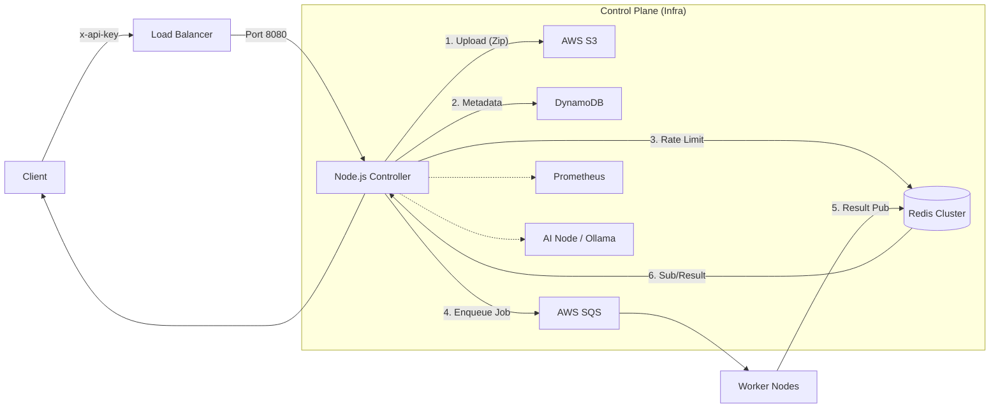

# ⚡ Infra: High-Density FaaS Controller

  

Infra Controller is a lightweight, high-performance FaaS (Function as a Service) platform controller designed for AWS EC2 environments. It eliminates cold start latency by leveraging a warm-pool architecture and ensures high throughput using Redis-based rate limiting and an asynchronous SQS job queue.

---

## 🏗 Architecture Overview

The Infra Controller acts as the central brain of the platform, orchestrating code uploads, job scheduling, and result retrieval. It integrates with an AI Node for model serving and Worker Nodes for function execution.



---

## ✨ Key Features

### 🛡️ 1. Advanced Security
- **API Key Authentication**: Strict `x-api-key` header verification prevents unauthorized access.
- **Atomic Rate Limiting**: Uses Redis Lua scripts to enforce exact rate limits (100 req/min per IP), effectively mitigating DDoS attacks.
- **Input Validation**: Rigorous checks on memory limits (128MB - 10GB) and file types.

### 🏥 2. Operational Stability
- **Fail-Fast Startup**: Deep validation of all required environment variables at startup; the process exits immediately (`exit 1`) if configuration is invalid for safety.
- **Graceful Shutdown**: Handles `SIGTERM`/`SIGINT` to close HTTP server and Redis connections safely, ensuring zero downtime deployments.
- **Smart Health Check**: The `/health` endpoint checks not just the process status but also Redis connectivity, allowing load balancers to isolate unhealthy nodes instantly.

### 🔭 3. Observability
- **Prometheus Metrics**: Built-in `/metrics` endpoint exporting RED (Rate, Errors, Duration) metrics.
    - `http_request_duration_seconds`: Histogram of response times.
- **Structured Logging**: All logs are emitted in JSON format for easy ingestion by Datadog, CloudWatch, or ELK Stack.
- **Traceable Request IDs**: Every request is assigned a UUID (`requestId`) for end-to-end tracing across distributed components.

---

## 🚀 Getting Started

### Prerequisites

- **Node.js**: v16 or higher
- **Redis**: v6+ (ElastiCache or self-hosted)
- **AWS Resources**: S3 Bucket, DynamoDB Table, SQS Queue

### Installation

```bash
# 1. Clone the repository
git clone https://github.com/sangmu1126/Infra-controller.git
cd infra-controller

# 2. Install dependencies
npm install
```

### Configuration

Create a `.env` file in the root directory. **All variables are required.**

| Variable | Description | Example |
| :--- | :--- | :--- |
| `PORT` | Service port | `8080` |
| `AWS_REGION` | AWS Region code | `ap-northeast-2` |
| `BUCKET_NAME` | S3 Bucket for code storage | `infra-code-bucket` |
| `TABLE_NAME` | DynamoDB Table name | `InfraFunctions` |
| `SQS_URL` | SQS Queue URL | `https://sqs.../infra-queue` |
| `REDIS_HOST` | Redis Endpoint | `infra-redis...cache.amazonaws.com` |
| `INFRA_API_KEY` | Secret key for auth | `your-secret-key-1234` |
| `AI_NODE_URL` | (Optional) AI Model Server | `http://10.0.20.100:11434` |

### Running the Server

```bash
# Development
node controller.js

# Production (PM2)
pm2 start controller.js --name "infra-controller"
```

---

## 📡 API Reference

All requests must include the header: `x-api-key: <YOUR_KEY>`

### Function Management

#### 1. Upload Function
Uploads a Python script or Zip file.
- **POST** `/upload`
- **Body**: `multipart/form-data` (`file`)
- **Params**: `memoryMb` (default: 128), `runtime` (default: python)

#### 2. List Functions
Retrieves all registered functions.
- **GET** `/functions`

#### 3. Update Function
Updates code or metadata for an existing function.
- **PUT** `/functions/:id`

#### 4. Delete Function
Deletes function metadata and S3 artifacts.
- **DELETE** `/functions/:id`

### Job Execution

#### 1. Run Function
Executes a function synchronously or asynchronously.
- **POST** `/run`
- **Headers**:
    - `x-async: true` (Optional, returns immediately with Job ID)
- **Body**:
```json
{
  "functionId": "uuid...",
  "inputData": { "key": "value" },
  "modelId": "llama3:8b"
}
```

#### 2. Job Status
Checks the status of an asynchronous job.
- **GET** `/status/:jobId`

### System

#### 1. Health Check
- **GET** `/health`
- **Response**: `200 OK` or `503 Service Unavailable`

#### 2. Metrics
- **GET** `/metrics` (Prometheus format)

#### 3. AI Models
- **GET** `/models` (Lists available AI models from AI Node)

---

## 💻 Terminal Output Demo

**Server Startup:**
```json
{"level":"INFO","timestamp":"2023-10-27T10:00:01.123Z","msg":"Global Redis Connected Successfully"}
{"level":"INFO","timestamp":"2023-10-27T10:00:01.125Z","msg":"Global Redis Subscriber Connected"}
{"level":"INFO","timestamp":"2023-10-27T10:00:01.130Z","msg":"Subscribed to result channels. Count: 1"}
{"level":"INFO","timestamp":"2023-10-27T10:00:01.135Z","msg":"Infra Controller v2.4 Started","port":8080}
```

**Function Execution:**
```json
{"level":"INFO","timestamp":"2023-10-27T10:05:22.450Z","msg":"Run Request","requestId":"a1b2c3d4...","functionId":"func-123","mode":"SYNC"}
```

**Error Handling:**
```json
{"level":"ERROR","timestamp":"2023-10-27T10:06:00.000Z","msg":"Upload Error","error":"Invalid memoryMb. Must be between 128 and 10240."}
```