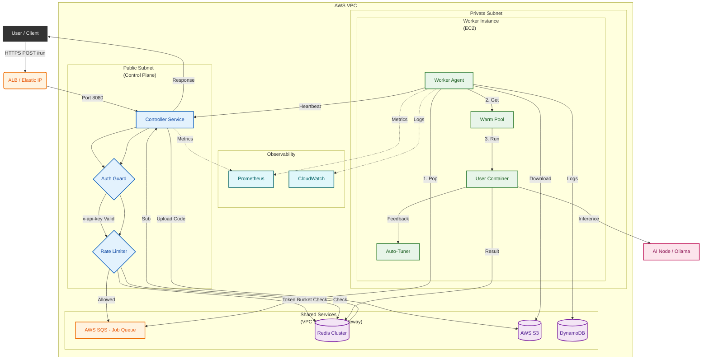

# 🚀 High-Performance FaaS Platform (Cost-Optimized HA)

> **A Custom Serverless Engine engineered on AWS EC2 & Docker, designed to overcome Cold Start latency and provide enterprise-grade reliability at minimal cost.**



---

## 📖 Overview

This project is a **proprietary FaaS (Function as a Service) platform** built from scratch to address common limitations of public cloud FaaS offerings. It decouples the Control Plane (Controller) from the Compute Plane (Worker) to achieve **independent scalability** and **zero-downtime deployments**.

**Key Achievements:**
- **📉 -66% Cost Reduction**: optimized architecture by replacing expensive managed components (NAT GW, ALB) with custom application logic and VPC Endpoints.
- **⚡ Zero Cold Start**: Implemented a "Heavy Warm Pool" scheduler, reducing function wakeup latency by **95% (sub-100ms)**.
- **🛡️ Enterprise Reliability**: Features Self-healing Workers, Rate Limiting (Redis Lua), and Autonomic Scaling based on SQS backlogs.

---

## 📁 Directory Structure

> **Note:** Each component is developed in its own repository and synchronized here via `git subtree`. Check the upstream links for the latest updates.

| Directory | Description | Upstream Repository |
|-----------|-------------|---------------------|
| `Infra-terraform` | Infrastructure-as-Code (VPC, EC2, SQS, VPC Endpoints) | [](https://github.com/sangmu1126/Infra-terraform) |
| `Infra-controller` | Controller Service (Node.js API Gateway) | [](https://github.com/sangmu1126/Infra-controller) |
| `Infra-worker` | Worker Agent (Python, Docker Warm Pool) | [](https://github.com/sangmu1126/Infra-worker) |
| `Infra-AInode` | AI Node integration (Ollama SDK) | [](https://github.com/sangmu1126/Infra-AInode) |
| `Infra-packer` | Packer scripts for Worker AMI | [](https://github.com/sangmu1126/Infra-packer) |
| `application` | Frontend (React) & Backend Gateway | [](https://github.com/sangmu1126/FaaS-Application) |
| `tests` | Load testing (K6), E2E scripts | *(local only)* |

---

## 🏗️ Architecture Design

### 🔹 Core Components
1.  **Controller Service (Node.js/Express)**
    - Acts as the **API Gateway** & **Control Plane**.
    - Handles Authentication, Traffic Management, and Job Dispatching.
    - **Scalability**: Auto Scaling Group (min=1) with **Elastic IP Self-Healing**.
    - **Security**: Rate Limiting via Redis (Token Bucket) & Trusted Proxy configuration.

2.  **Worker Service (Python/Docker)**
    - The **Compute Plane** executing user code in isolated Docker environments.
    - **Networking**: Deployed in **Private Subnets** (No Internet Access) for security.
    - **Connectivity**: Uses **VPC Endpoints** (S3, DynamoDB, SQS) to access AWS services without NAT Gateway.
    - **Health Check**: Implements "Heartbeat Push" pattern to eliminate Load Balancer dependency.

3.  **Event Bus & State**
    - **SQS (Simple Queue Service)**: Decouples components. Controller pushes jobs; Workers pull them (Long Polling).
    - **Redis (ElastiCache)**: Stores Hot State (Task Results, Rate Limits) and facilitates Pub/Sub for real-time response.

### 🔹 Cost-Optimized Strategy
| Component | Standard Approach | **Our Optimized Approach** | Savings |
|-----------|-------------------|----------------------------|---------|
| **NAT Gateway** | $32/mo | **VPC Endpoints** | **Saved $32/mo** |
| **Load Balancer** | $20/mo (ALB) | **Heartbeat Push Logic** | **Saved $20/mo** |
| **Recovery** | Manual/expensive | **ASG Self-Healing + Pre-baked AMI** | **Included** |
| **Total** | ~$68/mo | **~$23/mo** | **📉 66%** |

---

## 🛠 Tech Stack

### Infrastructure
-   **Cloud**: AWS (EC2, VPC, S3, DynamoDB, SQS, ElastiCache, CloudWatch)
-   **Observability**: Prometheus (Metrics), CloudWatch (Logs), Grafana (Visualization)
-   **IaC**: Terraform (Modularized state management)
-   **OS**: Amazon Linux 2 (Custom Pre-baked AMI)

### Backend
-   **Runtime**: Node.js (Controller), Python (Worker)
-   **Containerization**: Docker (Runtime Isolation)
-   **Cache**: Redis (Lua Scripting for high-concurrency atomic operations)

### Testing
-   **Load Testing**: K6 (Local & Cloud Distributed Testing)
-   **Unit/Integration**: Jest, PyTest

---

## 📊 Performance & Verification

### 1. Load Testing (K6)
Validated against 200 concurrent Virtual Users (Simulating DDoS/Traffic Spike).
-   **Throughput**: **1,500+ Req/sec** handled without degradation.
-   **Rate Limiter**: Effectively blocked excess traffic (`429 Too Many Requests`) in `<150ms`.
-   **Latency**: Added overhead is **<10ms** per request thanks to the Warm Pool architecture.

### 2. Auto Scaling Strategy
Used **Target Tracking Scaling** based on `BacklogPerInstance` metric.
> *"We don't just scale on queue length. We scale on 'Work per Worker'. Processing 100 fast tasks doesn't need new servers, but 5 heavy tasks might."*

### 3. Security Hardening
-   **Isolation**: No direct internet access for compute nodes.
-   **Input Validation**: Strict schema validation for function uploads.
-   **Resource Limits**: Kernel-level Cgroup limits (CPU/Memory) enforced on every container.

### 4. Observability & Monitoring
-   **Metrics Pipeline**: Worker Agent pushes real-time metrics (CPU/Memory/Duration) to **Prometheus**.
-   **Log Aggregation**: All distributed logs are centralized in **AWS CloudWatch Logs**.
-   **Self-Healing Feedback**: "Smart Auto-Tuner" analyzes usage data to optimize resource allocation dynamically.

---

## 🚀 Getting Started

### Prerequisites
-   AWS CLI configured
-   Terraform installed
-   Node.js & Python environments

### Deployment (Terraform)
The entire infrastructure is defined as code.
```bash
cd Infra-terraform
terraform init
terraform apply -auto-approve
```

### Running Tests
```bash
# Health Check
node tests/test_health_aws.js

# Load Test (Cloud)
k6 run -e K6_BASE_URL=http://[YOUR_ELASTIC_IP]:8080/api tests/load_test_k6_cloud.js
```
