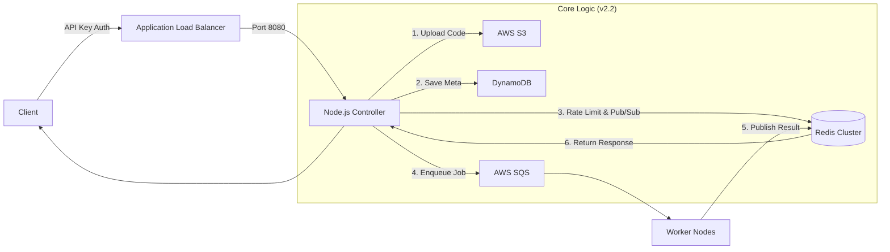

# ⚡ NanoGrid: High-Density FaaS Controller

NanoGrid는 AWS EC2 기반의 초경량 FaaS(Function as a Service) 플랫폼입니다. Lambda의 콜드 스타트 비용 없이, Redis와 SQS를 활용한 비동기 아키텍처로 높은 처리량과 안정성을 보장합니다.

## 🏗 Architecture Overview

NanoGrid는 Event-Driven Architecture를 기반으로 설계되었습니다.



## ✨ Key Features

NanoGrid Controller 는 단순한 MVP를 넘어, 실제 프로덕션 운영이 가능한 수준의 안정성과 보안을 갖추고 있습니다.

### 🛡️ 1. Advanced Security (보안)

- API Key Authentication: x-api-key 헤더 검증을 통한 비인가 접근 원천 차단.
- Atomic Rate Limiting: Redis Lua Script를 활용하여 원자성(Atomicity)이 보장된 속도 제한 구현 (DDoS 방어).
- Safe Input Handling: safeString 유틸리티를 통한 NoSQL Injection 및 데이터 오염 방지.

### 🏥 2. Operational Stability (운영 안정성)

- Fail-Fast Strategy: 서버 시작 시 필수 환경변수(REQUIRED_ENV)를 검증하여, 설정 누락 시 즉시 종료(Exit 1). 좀비 프로세스 방지.
- Graceful Shutdown: 배포나 스케일인 시 SIGTERM/SIGINT를 감지하여, 진행 중인 연결을 안전하게 처리 후 종료.
- Smart Health Check: 단순한 서버 가동 여부가 아닌, Redis 연결 상태까지 반영하여 로드 밸런서(ALB)가 장애 노드를 즉시 격리(503 Service Unavailable).

### 🔭 3. Observability (관측 가능성)

- Structured JSON Logging: console.log 대신 JSON 포맷 로깅을 적용하여 CloudWatch/Datadog 등에서 쿼리 및 분석 용이.
- Traceable Request ID: 모든 요청에 UUID(requestId)를 부여하여 전체 트랜잭션 추적 가능.

## 🚀 Getting Started

### Prerequisites

- Node.js v16+
- Redis (ElastiCache or Local)
- AWS Credentials (IAM Role or Key)

### Installation

```
# 1. Clone Repository
git clone https://github.com/your-repo/nanogrid-controller.git
cd nanogrid-controller

# 2. Install Dependencies
npm install
```

### Configuration (.env)

프로젝트 루트에 .env 파일을 생성하고 아래 변수들을 필수로 설정해야 합니다. (하나라도 없으면 서버가 켜지지 않습니다.)

```
PORT=8080
AWS_REGION=ap-northeast-2
BUCKET_NAME=nanogrid-code-bucket
TABLE_NAME=NanoGridFunctions
SQS_URL=https://sqs.ap-northeast-2.amazonaws.com/xxx/nanogrid-queue
REDIS_HOST=nanogrid-redis.xxxx.cache.amazonaws.com
NANOGRID_API_KEY=your-secret-api-key-1234
```

### Running the Server

```
# Production Mode (Recommended)
pm2 start controller.js --name "controller"

# Development Mode
node controller.js
```

## 📡 API Reference

모든 API 요청 헤더에는 반드시 x-api-key가 포함되어야 합니다.

### 1. Code Upload

파이썬 코드를 업로드하고 functionId를 발급받습니다.

```
URL: POST /upload
Headers: x-api-key: <YOUR_KEY>
Body: multipart/form-data (file: .py or .zip)

curl -X POST http://<ALB-DNS>/upload \
  -H "x-api-key: secret" \
  -F "file=@main.py"
```

### 2. Run Function

발급받은 ID로 함수를 비동기 실행하고 결과를 기다립니다. (Long Polling)

```
URL: POST /run
Headers: x-api-key: <YOUR_KEY>, Content-Type: application/json

{
  "functionId": "uuid-string",
  "inputData": { "name": "NanoGrid" }
}
```

### 3. Health Check

ALB가 사용하는 상태 검사 엔드포인트입니다.

```
URL: GET /health

200 OK: Redis 연결 정상.
503 Service Unavailable: Redis 연결 끊김 (트래픽 차단).
```

## 🛠 Project Structure

```
nanogrid-controller/
├── controller.js      # Main Entry Point (v2.2 Logic)
├── client.py          # Auto-deployment Client Script
├── package.json       # Dependencies
└── .env               # Environment Variables (Not committed)
```

## 👨‍💻 Client Automation (client.py)

번거로운 curl 명령어를 대체하는 Python 클라이언트가 포함되어 있습니다.

```
# 코드 수정 후 자동 배포 및 실행
python client.py main.py

# 기존 배포된 함수 재실행 (업로드 생략)
python client.py
```