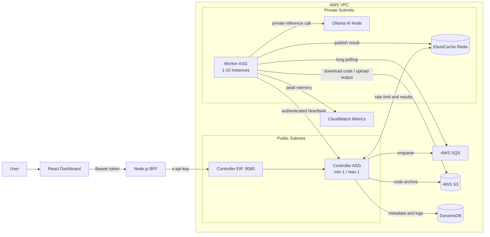
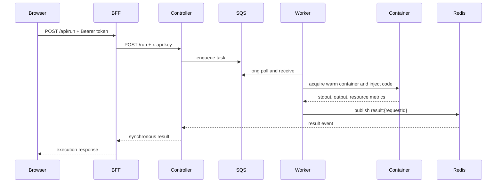

# High-Performance FaaS Platform

AWS EC2, Docker, SQS, Redis, S3, and DynamoDB로 구성한 커스텀 FaaS
(Function as a Service) 플랫폼입니다. Control Plane과 Compute Plane을 분리하고,
미리 준비한 Docker 컨테이너를 재사용하여 함수 실행 지연과 인프라 비용을 줄이는
것을 목표로 합니다.

이 저장소는 아키텍처와 성능을 검증하는 프로젝트입니다. Worker 자동 확장,
Controller 자동 복구, 함수 격리, 인증, 관측 기능을 구현했지만 TLS 종료, 다중 BFF
사용자 저장소, Application 배포 자동화 등은 운영 환경에 맞게 추가해야 합니다.

## Architecture


```mermaid
flowchart LR
    User[User] --> Web[React Dashboard]
    Web -->|Bearer token| BFF[Node.js BFF]
    BFF -->|x-api-key| EIP[Controller EIP :8080]

    subgraph AWS VPC
        subgraph Public Subnets
            EIP --> Controller[Controller ASG<br/>min 1 / max 1]
        end

        subgraph Private Subnets
            Worker[Worker ASG<br/>1-10 instances]
            Redis[(ElastiCache Redis)]
            AINode[Ollama AI Node]
        end

        SQS[AWS SQS]
        S3[(AWS S3)]
        DDB[(DynamoDB)]
        CW[CloudWatch Metrics]
    end

    Controller -->|enqueue| SQS
    Controller -->|metadata and logs| DDB
    Controller -->|code archive| S3
    Controller <-->|rate limit and results| Redis

    Worker -->|long polling| SQS
    Worker -->|download code / upload output| S3
    Worker -->|publish result| Redis
    Worker -->|authenticated heartbeat| Controller
    Worker -->|peak memory| CW
    Worker -->|private inference call| AINode
```

React와 BFF는 `application/`에 구현되어 있지만 현재 Terraform 배포 범위에는
포함되지 않습니다. Controller는 기본적으로 EIP의 HTTP 8080 포트를 사용하므로,
공개 운영 시에는 별도의 HTTPS reverse proxy 또는 TLS 종료 계층이 필요합니다.

## How a function runs


```mermaid
sequenceDiagram
    participant Browser
    participant BFF
    participant Controller
    participant SQS
    participant Worker
    participant Container
    participant Redis

    Browser->>BFF: POST /api/run + Bearer token
    BFF->>Controller: POST /run + x-api-key
    Controller->>SQS: enqueue task
    Worker->>SQS: long poll and receive
    Worker->>Container: acquire warm container and inject code
    Container-->>Worker: stdout, output, resource metrics
    Worker->>Redis: publish result:{requestId}
    Redis-->>Controller: result event
    Controller-->>BFF: synchronous result
    BFF-->>Browser: execution response
```

비동기 요청은 즉시 `jobId`를 반환하며 `/api/status/:jobId`에서 Redis에 저장된
결과를 조회할 수 있습니다.

## Core capabilities

### Application and access control

- React 19 Dashboard에서 함수 배포, 실행, 로그 및 metric 조회
- Node.js BFF에서 회원가입, 로그인, HMAC 서명 토큰 검증
- 비밀번호는 Node.js `scrypt`로 해시
- 브라우저는 Controller API key를 보유하지 않고 BFF만 `INFRA_API_KEY` 사용
- Controller에서 Redis Lua token bucket rate limiting 수행

현재 BFF 사용자 저장소는 로컬 `auth-users.json`입니다. 단일 BFF 데모에는 사용할
수 있지만 여러 BFF 인스턴스를 운영하려면 DynamoDB나 RDS 같은 공유 저장소로
교체해야 합니다.

### Controller

- 함수 ZIP을 S3에 업로드하고 메타데이터를 DynamoDB에 저장
- SQS를 통한 동기·비동기 작업 dispatch
- Redis Pub/Sub 결과 수신과 비동기 결과 TTL 저장
- DynamoDB 실행 로그와 invocation/duration 집계
- Worker heartbeat registry와 system status 제공
- Prometheus 형식의 HTTP 및 함수 실행 metric 노출
- 단일 인스턴스 ASG와 EIP 재연결을 통한 장애 시 자동 교체

Controller ASG는 `min=1`, `max=1`입니다. 이는 자동 복구 구성이며 동시에 여러
Controller가 요청을 처리하는 고가용성 구성은 아닙니다.

### Worker

- SQS batch long polling과 thread 기반 병렬 실행
- Python, Node.js, C++, Go 런타임 지원
- Runtime warm pool과 함수별 container 재사용
- UID/GID 65534 실행, Linux capability 제거, `no-new-privileges`, PID 제한
- `/workspace`, `/output` tmpfs와 Docker archive copy를 통한 코드 전달
- Cgroup v2 직접 조회를 통한 CPU, peak memory, disk I/O 수집
- Container network 통계를 통한 network usage 수집
- 실행 결과와 생성 파일을 S3에 비동기 업로드

### Resource recommendation

Worker의 Auto-Tuner는 peak memory, CPU, network, disk 사용량을 분석하여 권장
메모리와 예상 절감액을 결과에 포함합니다. 권장값은 자동으로 적용되지 않으며,
사용자나 별도 운영 자동화가 Controller의 함수 설정 API를 호출해야 합니다.

### Scaling and networking

- Worker ASG: `min=1`, `max=10`, SQS backlog-per-instance target tracking
- 추가 SQS high/low backlog alarm을 통한 scale-out/scale-in 보조
- Worker와 Redis는 private subnet에 배치
- NAT Gateway 대신 S3, DynamoDB, SQS, SSM, CloudWatch VPC Endpoint 사용
- Controller는 public subnet의 단일 인스턴스 ASG로 자동 복구
- SSH는 VPC 내부로 제한하고 SSM Session Manager 사용을 권장

Warm container 개수는 현재 환경 변수로 정적으로 설정됩니다. 트래픽 패턴을 학습해
pool 크기를 자동 조절하는 기능은 포함되어 있지 않습니다.

## Performance and cost results

아래 값은 프로젝트에서 직접 수행한 benchmark와 load test 결과입니다. 관련 스크립트는
`tests/`에, 상세 분석은 [성능·확장성 보고서](./REPORT_PERFORMANCE_SCALABILITY.md)에
정리되어 있습니다.

| 항목 | 측정 결과 |
|---|---:|
| 비용 절감 | 기존 약 $68/month → 약 $23/month, **66% 절감** |
| Warm Pool 함수 wakeup | **95% 감소, sub-100ms** |
| Runtime initialization | Native 약 **120ms**, Interpreted 약 **200ms** |
| Peak throughput | **520 requests/second** |
| Sustained throughput | **241 requests/second, 0% error rate** |
| Cgroup metric read | 평균 **15.5µs** |
| Docker API 대비 metric 수집 | **120,000x 향상** (`1994ms → 0.0155ms`) |

Cost comparison:

| Component | Standard approach | Current approach | Measured estimate |
|---|---|---|---:|
| NAT Gateway | Managed NAT Gateway | VPC Endpoints | $32/month 절감 |
| Load Balancer | ALB | EIP + heartbeat/self-healing | $20/month 절감 |
| Recovery | Manual replacement | ASG + pre-built AMI | 별도 관리 비용 감소 |
| Total | 약 $68/month | 약 $23/month | **66% 절감** |

Load test 조건과 해석은 다음 자료에서 확인할 수 있습니다.

- [Performance and scalability report](./REPORT_PERFORMANCE_SCALABILITY.md)
- [Cgroup benchmark](./tests/worker/benchmark_simple.py)
- [Controller load tests](./tests/controller)

## Observability and storage

| Data | Collection | Destination |
|---|---|---|
| Controller HTTP latency | `prom-client` | Controller `/metrics` scrape endpoint |
| Function duration/invocation | Redis result subscriber | Controller `/metrics`, DynamoDB metadata |
| Worker jobs/duration | `prometheus_client` | Worker `:8000/metrics` scrape endpoint |
| Peak memory | Cgroup v2 | CloudWatch custom metric |
| Execution logs | Worker result → Controller | DynamoDB logs table with TTL |
| Generated files | Worker output uploader | S3 user-data bucket |
| Process logs | JSON stdout/stderr | External collector 구성 시 수집 가능 |

Prometheus는 Worker나 Controller가 metric을 push하는 구조가 아니라 각 HTTP endpoint를
scrape합니다. Grafana와 CloudWatch Logs agent는 선택적으로 연결할 수 있지만 현재
Terraform에서 완전한 dashboard/log aggregation stack을 배포하지는 않습니다.

## Repository layout

| Directory | Responsibility |
|---|---|
| `Infra-terraform` | VPC, EC2 ASG, SQS, S3, DynamoDB, Redis, VPC Endpoints, IAM |
| `Infra-controller` | Express control plane and public infrastructure API |
| `Infra-worker` | Python worker agent, Docker execution, metrics, SDK injection |
| `Infra-AInode` | Ollama-compatible AI client integration |
| `Infra-packer` | Worker AMI build definition |
| `application/backend` | Authenticated BFF and Controller proxy |
| `application/frontend` | React/Vite management dashboard |
| `tests` | Worker unit tests, controller integration/load/security tests |

각 주요 디렉터리는 별도 upstream repository에서 개발된 이력이 있으며 이 저장소에
통합되어 있습니다.

## Technology stack

- AWS: EC2, Auto Scaling, SQS, S3, DynamoDB, ElastiCache, CloudWatch, SSM
- Infrastructure: Terraform, Packer, custom Controller AMI, Amazon Linux 2 Worker AMI template
- Backend: Node.js/Express Controller and BFF, Python Worker
- Runtime isolation: Docker, Cgroup v2
- Frontend: React 19, Vite, TypeScript, Zustand, Recharts, Tailwind CSS
- Tests: Python `unittest`, Node.js integration scripts, K6 load tests

Worker Packer 정의는 현재 Amazon Linux 2 기반 AMI를 생성하고, Terraform의 일반
Controller AMI 조회는 Amazon Linux 2023을 사용합니다. 실제 Worker 배포에는 Packer가
생성한 최신 `faas-worker-*` AMI가 사용됩니다.

## Getting started

### Prerequisites

- AWS CLI profile, AWS SSO, 또는 CI OIDC Role
- Terraform 1.0+
- Packer 1.9+
- Node.js 18+
- Python 3.9+
- Docker Engine이 설치된 Linux Worker 환경

Terraform과 EC2 `.env`에 장기 AWS Access/Secret Key를 입력하지 않습니다. Terraform은
실행 환경의 AWS credential chain을 사용하고 EC2 애플리케이션은 Instance Profile을
사용합니다.

### 1. Prepare AMIs

Worker AMI:

```bash
cd Infra-packer
packer init .
packer build worker-ami.pkr.hcl
```

Terraform은 가장 최근의 self-owned `faas-worker*` AMI를 조회합니다. Controller
Launch Template은 self-owned `faas-controller` AMI를 기대하지만, 해당 Controller
AMI builder는 이 모노레포에 포함되어 있지 않습니다. Terraform 적용 전에 AMI를
별도로 준비하거나 `controller_asg.tf`의 AMI source를 환경에 맞게 변경해야 합니다.

### 2. Provision AWS infrastructure

```bash
cd Infra-terraform
terraform init
terraform fmt -check
terraform validate
terraform plan
terraform apply
```

배포 후 BFF에 전달할 내부 키와 Controller 주소를 확인합니다.

```bash
terraform output -raw infra_api_key
terraform output -raw api_endpoint
```

### 3. Start the BFF

```bash
cd application/backend
npm install
cp .env.example .env
```

필수 환경 변수:

```dotenv
PORT=8080
AWS_CONTROLLER_URL=http://<CONTROLLER_HOST>:8080
INFRA_API_KEY=<TERRAFORM_INFRA_API_KEY_OUTPUT>
AUTH_TOKEN_SECRET=<AT_LEAST_32_RANDOM_CHARACTERS>
```

```bash
npm run dev
```

### 4. Start the dashboard

```bash
cd application/frontend
npm ci
cp .env.example .env
```

```dotenv
VITE_API_BASE_URL=http://<BFF_HOST>:8080/api
```

```bash
npm run dev
```

Vite development server의 기본 주소는 `http://localhost:3000`입니다.

### 5. Run local checks

Worker unit tests:

```bash
python3 -m venv /tmp/faas-platform-venv
source /tmp/faas-platform-venv/bin/activate
pip install -r Infra-worker/requirements.txt
python -m unittest discover -s tests/unit -p 'test_*.py'
```

Frontend production build:

```bash
npm ci --prefix application/frontend
npm run build --prefix application/frontend
```

AWS integration and load tests require a deployed Controller, Redis, SQS, DynamoDB, S3, and
Worker environment. See [tests/README.md](./tests/README.md) for the environment-specific commands.

## Security and operational notes

- [Security and reliability hardening](./SECURITY_RELIABILITY_HARDENING.md)
- [Functional and security report](./REPORT_FUNCTIONAL_SECURITY.md)
- [Troubleshooting guide](./TROUBLESHOOTING.md)
- [Architecture details](./ARCHITECTURE.md)

Before a public deployment:

1. Add HTTPS termination in front of the BFF and Controller.
2. Move BFF users from `auth-users.json` to a shared database.
3. Store BFF secrets in a managed secret store and define rotation procedures.
4. Run Docker isolation tests on the target Linux/Cgroup v2 host.
5. Configure Prometheus scraping, dashboarding, alerting, and centralized process logs.
6. Add a multi-Controller design if request-plane high availability is required.
