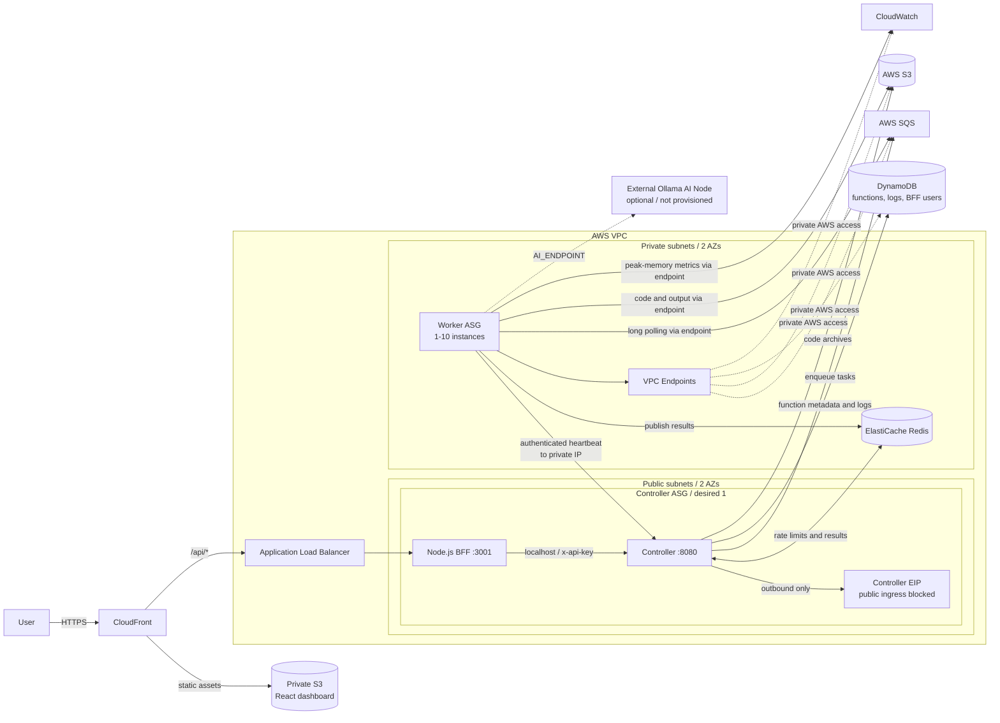
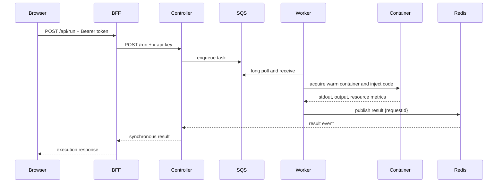

# High-Performance FaaS Platform

[Korean](./README_KOR.md) | **English**

A custom FaaS (Function as a Service) platform built with AWS EC2, Docker, SQS,
Redis, S3, and DynamoDB. It separates the control plane from the compute plane and
reuses pre-warmed Docker containers to reduce function startup latency and
infrastructure cost.

This repository is an architecture and performance validation project. It implements
Worker autoscaling, Controller self-healing, function isolation, authentication,
observability, and one-command delivery of the public dashboard. The dashboard is
served through CloudFront, while the self-hosted BFF runs beside the Controller on EC2;
AWS Lambda is not part of the request path.

## Architecture


```mermaid
flowchart LR
    User[User] -->|HTTPS| CF[CloudFront]
    CF -->|static assets| Web[(Private S3<br/>React dashboard)]
    CF -->|/api/*| ALB[Application Load Balancer]

    subgraph VPC[AWS VPC]
        subgraph Public[Public subnets / 2 AZs]
            subgraph Host[Controller ASG / desired 1]
                BFF[Node.js BFF :3001]
                Controller[Controller :8080]
                BFF -->|localhost / x-api-key| Controller
                Controller -->|outbound only| EIP[Controller EIP<br/>public ingress blocked]
            end
        end

        subgraph Private[Private subnets / 2 AZs]
            Worker[Worker ASG<br/>1-10 instances]
            Redis[(ElastiCache Redis)]
            Endpoints[VPC Endpoints]
        end

        ALB --> BFF
        Worker -->|authenticated heartbeat<br/>to private IP| Controller
        Controller <-->|rate limits and results| Redis
        Worker -->|publish results| Redis
        Worker --> Endpoints
    end

    SQS[AWS SQS]
    S3[(AWS S3)]
    DDB[(DynamoDB<br/>functions, logs, BFF users)]
    CW[CloudWatch]
    AI[External Ollama AI Node<br/>optional / not provisioned]

    Controller -->|enqueue tasks| SQS
    Controller -->|function metadata and logs| DDB
    Controller -->|code archives| S3
    Worker -->|long polling via endpoint| SQS
    Worker -->|code and output via endpoint| S3
    Worker -->|peak-memory metrics via endpoint| CW
    Endpoints -. private AWS access .-> SQS
    Endpoints -. private AWS access .-> S3
    Endpoints -. private AWS access .-> DDB
    Endpoints -. private AWS access .-> CW
    Worker -. AI_ENDPOINT .-> AI
```

Terraform provisions both application entry points. CloudFront terminates public HTTPS,
serves the React build from a private S3 origin, and sends `/api/*` to an ALB. The ALB
accepts traffic only from the AWS-managed CloudFront origin-facing prefix list and
forwards it to the BFF on port 3001. The BFF and Controller share the self-healing
Controller instance, communicating over localhost without exposing the infrastructure
API key to the browser.

The Ollama AI Node is an optional external integration referenced by `AI_ENDPOINT`.
This repository does not currently provision the AI Node or its network with Terraform.

## How a function runs


```mermaid
sequenceDiagram
    participant Browser
    participant BFF
    participant Controller
    participant SQS
    participant Worker
    participant Container
    participant Redis

    Browser->>BFF: POST /api/run + Bearer token
    BFF->>Controller: POST /run + x-api-key
    Controller->>SQS: enqueue task
    Worker->>SQS: long poll and receive
    Worker->>Container: acquire warm container and inject code
    Container-->>Worker: stdout, output, resource metrics
    Worker->>Redis: publish result:{requestId}
    Redis-->>Controller: result event
    Controller-->>BFF: synchronous result
    BFF-->>Browser: execution response
```

Asynchronous requests immediately return a `jobId`. The result stored in Redis can
then be retrieved from `/api/status/:jobId`.

## Core capabilities

### Application and access control

- Deploy and invoke functions and inspect logs and metrics from the React 19 dashboard
- Register users, sign in, and validate HMAC-signed tokens through the Node.js BFF
- Hash passwords with Node.js `scrypt`
- Keep the Controller API key out of the browser; only the BFF uses `INFRA_API_KEY`
- Apply Redis Lua token-bucket rate limiting in the Controller

The deployed BFF stores users in an on-demand DynamoDB table and uses conditional writes
to prevent duplicate email registration. Local development retains the lightweight
`auth-users.json` fallback when `AUTH_USERS_TABLE` is not configured.

### Controller

- Upload function ZIP archives to S3 and store metadata in DynamoDB
- Dispatch synchronous and asynchronous jobs through SQS
- Receive results through Redis Pub/Sub and retain asynchronous results with a TTL
- Store execution logs and invocation/duration aggregates in DynamoDB
- Maintain the Worker heartbeat registry and expose system status
- Expose HTTP and function-execution metrics in Prometheus format
- Replace failed instances automatically through a single-instance ASG and EIP reassociation

The Controller ASG uses `min=1` and `max=1`. This provides automatic recovery, not a
high-availability request plane in which multiple Controllers serve traffic concurrently.

### Worker

- Batch long-poll SQS and execute jobs concurrently with worker threads
- Support Python, Node.js, C++, and Go runtimes
- Maintain runtime warm pools and reuse per-function containers
- Run as UID/GID 65534 with Linux capabilities removed, `no-new-privileges`, and PID limits
- Deliver code through `/workspace` and `/output` tmpfs mounts and Docker archive copy
- Collect CPU, peak memory, and disk I/O by reading Cgroup v2 directly
- Collect network usage from container network statistics
- Upload execution results and generated files to S3 asynchronously

### Resource recommendation

The Worker Auto-Tuner analyzes peak memory, CPU, network, and disk usage and includes
a recommended memory allocation and estimated savings in the result. Recommendations
are not applied automatically; a user or separate operational automation must call the
Controller function-configuration API.

### Scaling and networking

- Worker ASG: `min=1`, `max=10`, with SQS backlog-per-instance target tracking
- Supplement scale-out and scale-in with SQS high/low backlog alarms
- Place Workers and Redis in private subnets
- Use S3, DynamoDB, SQS, SSM, and CloudWatch VPC endpoints instead of a NAT Gateway
- Self-heal the Controller through a single-instance ASG in a public subnet
- Restrict SSH to the VPC and prefer SSM Session Manager

The warm-container count is currently configured statically through environment
variables. Automatic pool sizing based on learned traffic patterns is not included.

## Performance and cost results

The following figures come from benchmarks and load tests run directly for this
project. The related scripts are under `tests/`, and the detailed analysis is available
in the [performance and scalability report](./REPORT_PERFORMANCE_SCALABILITY.md).

| Item | Measured result |
|---|---:|
| Cost reduction | Approximately $68/month → $23/month, a **66% reduction** |
| Warm-pool function wakeup | **95% reduction, sub-100ms** |
| Runtime initialization | Approximately **120ms** for native and **200ms** for interpreted runtimes |
| Peak throughput | **520 requests/second** |
| Sustained throughput | **241 requests/second, 0% error rate** |
| Cgroup metric read | **15.5µs** average |
| Metric collection vs. Docker API | **120,000x improvement** (`1994ms → 0.0155ms`) |

Cost comparison:

| Component | Standard approach | Current approach | Measured estimate |
|---|---|---|---:|
| NAT Gateway | Managed NAT Gateway | VPC Endpoints | $32/month savings |
| Load Balancer | ALB | EIP + heartbeat/self-healing | $20/month savings |
| Recovery | Manual replacement | ASG + pre-built AMI | Lower operational overhead |
| Total | Approximately $68/month | Approximately $23/month | **66% reduction** |

See the following resources for load-test conditions and interpretation:

- [Performance and scalability report](./REPORT_PERFORMANCE_SCALABILITY.md)
- [Cgroup benchmark](./tests/worker/benchmark_simple.py)
- [Controller load tests](./tests/controller)

## Observability and storage

| Data | Collection | Destination |
|---|---|---|
| Controller HTTP latency | `prom-client` | Controller `/metrics` scrape endpoint |
| Function duration/invocation | Redis result subscriber | Controller `/metrics`, DynamoDB metadata |
| Worker jobs/duration | `prometheus_client` | Worker `:8000/metrics` scrape endpoint |
| Peak memory | Cgroup v2 | CloudWatch custom metric |
| Execution logs | Worker result → Controller | DynamoDB logs table with TTL |
| Generated files | Worker output uploader | S3 user-data bucket |
| Process logs | JSON stdout/stderr | Available when an external collector is configured |

Prometheus scrapes each HTTP endpoint; Workers and the Controller do not push metrics.
Grafana and a CloudWatch Logs agent can be connected separately, but the current
Terraform configuration does not deploy a complete dashboard and log-aggregation stack.

## Repository layout

| Directory | Responsibility |
|---|---|
| `Infra-terraform` | VPC, EC2 ASG, SQS, S3, DynamoDB, Redis, VPC Endpoints, IAM |
| `Infra-controller` | Express control plane and public infrastructure API |
| `Infra-worker` | Python worker agent, Docker execution, metrics, SDK injection |
| `Infra-AInode` | Ollama-compatible AI client integration |
| `Infra-packer` | Worker/Controller AMI build definitions |
| `application/backend` | Authenticated BFF and Controller proxy |
| `application/frontend` | React/Vite management dashboard |
| `tests` | Worker unit tests, controller integration/load/security tests |

The major directories were originally developed in separate upstream repositories and
have been integrated into this repository.

## Technology stack

- AWS: EC2, Auto Scaling, SQS, S3, DynamoDB, ElastiCache, CloudWatch, SSM
- Infrastructure: Terraform, Packer, Amazon Linux 2023 Controller/Worker AMIs
- Backend: Node.js/Express Controller and BFF, Python Worker
- Runtime isolation: Docker, Cgroup v2
- Frontend: React 19, Vite, TypeScript, Zustand, Recharts, Tailwind CSS
- Tests: Python `unittest`, Node.js integration scripts, K6 load tests

Packer creates Amazon Linux 2023 Worker and Controller AMIs. Terraform selects the
latest self-owned images matching `faas-worker*` and `faas-controller*`, respectively.
The [implementation and deployment report](./DEPLOYMENT_IMPLEMENTATION_REPORT.md)
documents the implementation, deployment process, and verification results.

## Getting started

### Prerequisites

- AWS CLI profile, AWS SSO, or a CI OIDC role
- Terraform 1.0+
- Packer 1.9+
- Node.js 18+
- Python 3.9+
- A Linux Worker environment with Docker Engine installed

Do not place long-lived AWS access or secret keys in Terraform or EC2 `.env` files.
Terraform uses the AWS credential chain of its execution environment, while EC2
applications use instance profiles.

### 1. Prepare AMIs

Worker AMI:

```bash
cd Infra-packer
packer init worker-ami.pkr.hcl
packer build worker-ami.pkr.hcl
```

Controller AMI:

```bash
cd Infra-packer
packer init controller-ami.pkr.hcl
packer build controller-ami.pkr.hcl
```

Terraform looks up the latest self-owned `faas-worker*` and `faas-controller*` AMIs.
Build both AMIs before running a Terraform plan.

### 2. Deploy the complete platform

```bash
./scripts/deploy.sh
```

The script installs locked dependencies, builds React with the same-origin `/api`
endpoint, packages the BFF, applies Terraform, uploads static assets, invalidates
CloudFront, verifies `/api/health`, and prints the public URL. Existing Packer AMIs are
reused.

```bash
terraform -chdir=Infra-terraform output -raw application_url
```

To remove every Terraform-managed resource while retaining Packer AMIs and snapshots:

```bash
./scripts/destroy.sh
```

CloudFront assigns a new default hostname after a destroy and redeploy. This does not
break the system because Terraform rewires every internal address. Add a custom domain,
Route 53 record, and ACM certificate only when a stable portfolio URL is required.

### 3. Run the BFF locally

```bash
cd application/backend
npm install
cp .env.example .env
```

Required environment variables:

```dotenv
PORT=8080
AWS_CONTROLLER_URL=http://<CONTROLLER_HOST>:8080
INFRA_API_KEY=<TERRAFORM_INFRA_API_KEY_OUTPUT>
AUTH_TOKEN_SECRET=<AT_LEAST_32_RANDOM_CHARACTERS>
```

```bash
npm run dev
```

### 4. Run the dashboard locally

```bash
cd application/frontend
npm ci
cp .env.example .env
```

```dotenv
VITE_API_BASE_URL=http://<BFF_HOST>:8080/api
```

```bash
npm run dev
```

The Vite development server listens on `http://localhost:3000` by default.

### 5. Run local checks

Worker unit tests:

```bash
python3 -m venv /tmp/faas-platform-venv
source /tmp/faas-platform-venv/bin/activate
pip install -r Infra-worker/requirements.txt
python -m unittest discover -s tests/unit -p 'test_*.py'
```

Frontend production build:

```bash
npm ci --prefix application/frontend
npm run build --prefix application/frontend
```

AWS integration and load tests require a deployed Controller, Redis, SQS, DynamoDB, S3, and
Worker environment. See [tests/README.md](./tests/README.md) for the environment-specific commands.

## Security and operational notes

- [Security and reliability hardening](./SECURITY_RELIABILITY_HARDENING.md)
- [Functional and security report](./REPORT_FUNCTIONAL_SECURITY.md)
- [Troubleshooting guide](./TROUBLESHOOTING.md)
- [Architecture details](./ARCHITECTURE.md)
- [Implementation and deployment report](./DEPLOYMENT_IMPLEMENTATION_REPORT.md)

Before a long-lived public deployment:

1. Add a custom domain and ACM certificate if a stable URL and an explicit modern TLS policy are required.
2. Store BFF secrets in a managed secret store and define rotation procedures.
3. Run Docker isolation tests on the target Linux/Cgroup v2 host.
4. Configure Prometheus scraping, dashboarding, alerting, and centralized process logs.
5. Separate or horizontally scale the BFF and Controller when request-plane high availability is required.
