# ⚡ Infra-controller

<div align="center">


**The Central Nervous System of the FaaS Platform**

*Traffic Orchestration • Resource Governance • Real-time Monitoring*

</div>

---

## 📖 Introduction

The **Infra Controller** acts as the high-throughput brain of the serverless architecture. Leveraging the non-blocking I/O of **Node.js**, it handles request authentication, rate limiting, and intelligent job distribution to the worker fleet.

It now supports **Dynamic Resource Resizing**, allowing users and Auto-Tuners to adjust function memory configuration on the fly without service interruption.

---

## 🏗️ Architecture

```mermaid
graph LR
    User[Client / CLI] -- "x-api-key" --> ALB[Load Balancer]
    ALB -- Port 8080 --> Control[⚡ Controller]
    
    subgraph "Control Plane"
        Control -- "1. Auth & Rate Limit" --> Redis[(Redis Cluster)]
        Control -- "2. Metadata / Logs" --> DDB[DynamoDB]
        Control -- "3. Enqueue Job" --> SQS[AWS SQS]
    end

    subgraph "Worker Plane"
        SQS --> Worker[Worker Fleet]
        Worker -- "4. Pub Result" --> Redis
    end
    
    Redis -- "5. Push Result" --> Control
    Control --> User
```



---

## ✨ Key Features

### 🛡️ Enterprise Security & Governance
- **API Guard**: Strict authentication via `x-api-key` header verification.
- **Traffic Control**: Atomic rate limiting using Redis Lua Scripts (e.g., 100 req/min depending on IP).
- **Validation**: Strict schema checks for input payloads and configuration updates.

### 🏥 Operational Stability (Resilience)
- **Fail-Fast Startup**: Immediately exits if critical environment variables (AWS credentials, DB Table) are missing to prevent "Zombie" states.
- **Graceful Shutdown**: Safely closes pending requests and DB connections upon `SIGTERM` (Zero Downtime deployment).
- **Deep Health Check**: `/health` endpoint validates Redis connectivity and Queue depth, not just process uptime.

### 🔭 Deep Observability
- **RED Metrics**: Exposes Requests, Errors, and Duration metrics via `/metrics` (Prometheus).
- **Audit Logs**: Archives full execution history to DynamoDB (`InfraExecutionLogs`) with auto-expiry (TTL).
- **Tracing**: End-to-end traceability with UUID-based Request IDs.

### ⚡ Dynamic Management (New)
- **Hot-Swap Config**: Update function memory (`memoryMb`) and description instantly via API.
- **Auto-Tuner Support**: Accepts optimization commands from the Auto-Tuner engine to resize memory with a single click.

---

## 🚀 Getting Started

### Environment Setup (`.env`)

| Variable | Description | Example |
|----------|-------------|---------|
| `PORT` | Service Port | `8080` |
| `TABLE_NAME` | Metadata Table | `InfraFunctions` |
| `LOGS_TABLE_NAME` | Logs Table | `InfraExecutionLogs` |
| `SQS_URL` | Task Queue URL | `https://sqs...` |
| `REDIS_HOST` | Redis Endpoint | `localhost` |
| `INFRA_API_KEY`| Master Auth Key | `secret-key` |

### Launch Commands
```bash
# 1. Install
npm install

# 2. Run (Dev)
node controller.js

# 3. Production (PM2)
pm2 start controller.js --name "faas-controller" -i max
```

---

## 📡 API Reference

**Auth Header**: `x-api-key: <YOUR_SECRET_KEY>`

### 1. Execute Function
`POST /run`
Orchestrates a synchronous or asynchronous execution.
```json
// Request
{ 
  "functionId": "func-123", 
  "inputData": { "msg": "hello" } 
}

// Response
{
  "status": "SUCCESS",
  "data": "Result...",
  "durationMs": 120
}
```

### 2. Update Configuration (New)
`PUT /functions/:id`
Now supports **On-the-fly Memory Resizing**.
```json
// Request
{
  "description": "Optimized by Auto-Tuner",
  "memoryMb": 128  // Updated from 512
}
```

### 3. Get Logs
`GET /api/functions/:id/logs`
Fetch historical execution logs with pagination.

---

## 💻 Terminal Output Demo

**Server Startup:**
```json
{"level":"INFO","msg":"Global Redis Connected Successfully"}
{"level":"INFO","msg":"Infra Controller v2.5 Started","port":8080}
```

**Function Execution:**
```json
{"level":"INFO","msg":"Run Request","requestId":"a1b2...","functionId":"func-123","mode":"SYNC"}
{"level":"INFO","msg":"Execution Success","duration":120}
```

---

<div align="center">
  <sub>Built for Scalability and Control</sub>
</div>
