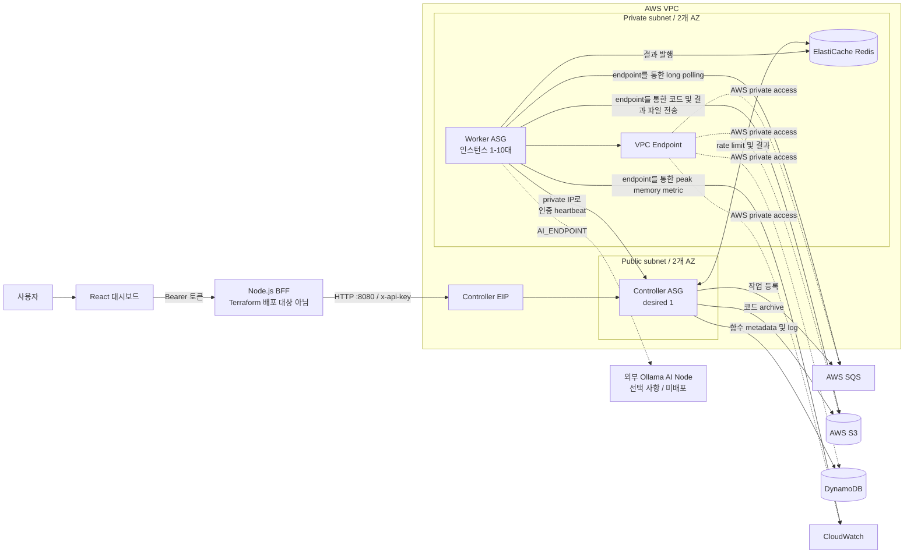
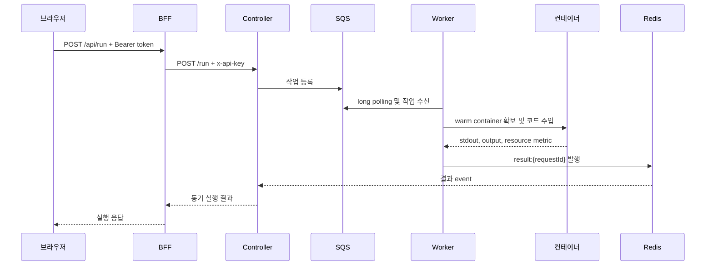

# 고성능 FaaS 플랫폼

**한국어** | [English](./README.md)

AWS EC2, Docker, SQS, Redis, S3, DynamoDB로 구성한 커스텀 FaaS
(Function as a Service) 플랫폼입니다. Control Plane과 Compute Plane을 분리하고,
미리 준비한 Docker 컨테이너를 재사용해 함수 시작 지연과 인프라 비용을 줄입니다.

이 저장소는 아키텍처와 성능을 검증하기 위한 프로젝트입니다. Worker 자동 확장,
Controller 자동 복구, 함수 격리, 인증, 관측 기능을 구현했습니다. 실제 운영 환경에는
TLS 종료, 여러 BFF 인스턴스가 공유하는 사용자 저장소, 애플리케이션 배포 자동화 같은
환경별 구성이 추가로 필요합니다.

## 아키텍처



React 대시보드와 BFF는 `application/`에 구현되어 있지만 현재 Terraform 배포 범위에는
포함되지 않습니다. Controller는 기본적으로 EIP의 HTTP 8080 포트를 사용하므로 공개
운영 시에는 별도의 HTTPS reverse proxy 또는 TLS 종료 계층이 필요합니다.

Ollama AI Node는 `AI_ENDPOINT`로 참조하는 선택적 외부 연동입니다. 이 저장소의
Terraform은 현재 AI Node 또는 관련 네트워크를 생성하지 않습니다.

## 함수 실행 흐름



비동기 요청은 즉시 `jobId`를 반환합니다. Redis에 저장된 결과는
`/api/status/:jobId`에서 조회할 수 있습니다.

## 핵심 기능

### 애플리케이션과 접근 제어

- React 19 대시보드에서 함수 배포·실행 및 로그·metric 조회
- Node.js BFF에서 회원가입, 로그인, HMAC 서명 token 검증
- Node.js `scrypt`를 이용한 비밀번호 hash
- 브라우저에는 Controller API key를 노출하지 않고 BFF만 `INFRA_API_KEY` 사용
- Controller에서 Redis Lua token bucket rate limiting 적용

BFF는 현재 사용자를 로컬 `auth-users.json` 파일에 저장합니다. 단일 인스턴스
데모에는 충분하지만 여러 BFF 인스턴스를 운영하려면 DynamoDB나 RDS 같은 공유
저장소가 필요합니다.

### Controller

- 함수 ZIP archive를 S3에 업로드하고 metadata를 DynamoDB에 저장
- SQS를 통해 동기·비동기 작업 dispatch
- Redis Pub/Sub으로 결과를 수신하고 비동기 결과를 TTL과 함께 보관
- DynamoDB에 실행 log 및 invocation/duration 집계 저장
- Worker heartbeat registry 관리 및 system status 제공
- Prometheus 형식으로 HTTP 및 함수 실행 metric 제공
- 단일 인스턴스 ASG와 EIP 재연결로 장애 인스턴스 자동 교체

Controller ASG는 `min=1`, `max=1`입니다. 자동 복구는 제공하지만 여러 Controller가
동시에 요청을 처리하는 고가용성 request plane은 아닙니다.

### Worker

- SQS batch long polling 및 worker thread 기반 병렬 실행
- Python, Node.js, C++, Go runtime 지원
- Runtime warm pool 유지 및 함수별 container 재사용
- UID/GID 65534 실행, Linux capability 제거, `no-new-privileges`, PID 제한
- `/workspace`, `/output` tmpfs mount와 Docker archive copy로 코드 전달
- Cgroup v2 직접 조회를 통한 CPU, peak memory, disk I/O 수집
- Container network 통계에서 network 사용량 수집
- 실행 결과와 생성 파일을 S3에 비동기 업로드

### 리소스 권장

Worker Auto-Tuner는 peak memory, CPU, network, disk 사용량을 분석하고 권장 memory와
예상 절감액을 결과에 포함합니다. 권장값은 자동 적용되지 않습니다. 사용자 또는 별도
운영 자동화가 Controller의 함수 설정 API를 호출해야 합니다.

### 확장과 네트워크

- Worker ASG: `min=1`, `max=10`, SQS backlog-per-instance target tracking
- SQS high/low backlog alarm으로 scale-out과 scale-in 보조
- Worker와 Redis를 private subnet에 배치
- NAT Gateway 대신 S3, DynamoDB, SQS, SSM, CloudWatch VPC Endpoint 사용
- Public subnet의 단일 인스턴스 ASG로 Controller 자동 복구
- SSH를 VPC 내부로 제한하고 SSM Session Manager 사용 권장

Warm container 개수는 현재 환경 변수로 정적으로 설정합니다. 학습한 traffic pattern을
기반으로 pool 크기를 자동 조절하는 기능은 포함되어 있지 않습니다.

## 성능 및 비용 결과

다음 수치는 이 프로젝트에서 직접 수행한 benchmark와 load test 결과입니다. 관련
script는 `tests/`에 있으며 상세 분석은
[성능 및 확장성 보고서](./REPORT_PERFORMANCE_SCALABILITY.md)에서 확인할 수 있습니다.

| 항목 | 측정 결과 |
|---|---:|
| 비용 절감 | 약 $68/month → $23/month, **66% 절감** |
| Warm pool 함수 wakeup | **95% 감소, 100ms 미만** |
| Runtime 초기화 | Native 약 **120ms**, interpreted runtime 약 **200ms** |
| 최대 처리량 | **520 requests/second** |
| 지속 처리량 | **241 requests/second, 오류율 0%** |
| Cgroup metric 조회 | 평균 **15.5µs** |
| Docker API 대비 metric 수집 | **120,000배 개선** (`1994ms → 0.0155ms`) |

비용 비교:

| 구성 요소 | 일반적인 방식 | 현재 방식 | 측정 추정치 |
|---|---|---|---:|
| NAT Gateway | Managed NAT Gateway | VPC Endpoint | $32/month 절감 |
| Load Balancer | ALB | EIP + heartbeat/self-healing | $20/month 절감 |
| 복구 | 수동 교체 | ASG + 사전 제작 AMI | 운영 관리 비용 감소 |
| 전체 | 약 $68/month | 약 $23/month | **66% 절감** |

Load test 조건과 해석은 다음 자료를 참고하십시오.

- [성능 및 확장성 보고서](./REPORT_PERFORMANCE_SCALABILITY.md)
- [Cgroup benchmark](./tests/worker/benchmark_simple.py)
- [Controller load test](./tests/controller)

## 관측 및 저장소

| 데이터 | 수집 방식 | 저장·제공 위치 |
|---|---|---|
| Controller HTTP latency | `prom-client` | Controller `/metrics` scrape endpoint |
| 함수 duration/invocation | Redis 결과 subscriber | Controller `/metrics`, DynamoDB metadata |
| Worker job/duration | `prometheus_client` | Worker `:8000/metrics` scrape endpoint |
| Peak memory | Cgroup v2 | CloudWatch custom metric |
| 실행 log | Worker 결과 → Controller | TTL이 설정된 DynamoDB log table |
| 생성 파일 | Worker output uploader | S3 user-data bucket |
| Process log | JSON stdout/stderr | 외부 collector 구성 시 수집 가능 |

Prometheus는 각 HTTP endpoint를 scrape하며 Worker와 Controller가 metric을 push하지는
않습니다. Grafana와 CloudWatch Logs agent는 별도로 연결할 수 있지만 현재 Terraform은
완전한 dashboard 및 log aggregation stack을 배포하지 않습니다.

## 저장소 구조

| 디렉터리 | 역할 |
|---|---|
| `Infra-terraform` | VPC, EC2 ASG, SQS, S3, DynamoDB, Redis, VPC Endpoint, IAM |
| `Infra-controller` | Express control plane 및 public infrastructure API |
| `Infra-worker` | Python worker agent, Docker 실행, metric, SDK 주입 |
| `Infra-AInode` | Ollama 호환 AI client 연동 |
| `Infra-packer` | Worker/Controller AMI build 정의 |
| `application/backend` | 인증 BFF 및 Controller proxy |
| `application/frontend` | React/Vite 관리 dashboard |
| `tests` | Worker unit test, Controller integration/load/security test |

주요 디렉터리는 원래 별도의 upstream 저장소에서 개발되었으며 이 저장소에
통합되어 있습니다.

## 기술 스택

- AWS: EC2, Auto Scaling, SQS, S3, DynamoDB, ElastiCache, CloudWatch, SSM
- Infrastructure: Terraform, Packer, Amazon Linux 2023 Controller/Worker AMI
- Backend: Node.js/Express Controller 및 BFF, Python Worker
- Runtime 격리: Docker, Cgroup v2
- Frontend: React 19, Vite, TypeScript, Zustand, Recharts, Tailwind CSS
- Test: Python `unittest`, Node.js integration script, K6 load test

Packer는 Amazon Linux 2023 Worker 및 Controller AMI를 생성합니다. Terraform은
self-owned image 중 `faas-worker*`, `faas-controller*`와 일치하는 최신 image를 각각
선택합니다. [구현 및 배포 보고서](./DEPLOYMENT_IMPLEMENTATION_REPORT.md)에는 실제
구현·배포 과정과 검증 결과가 정리되어 있습니다.

## 시작하기

### 사전 요구 사항

- AWS CLI profile, AWS SSO 또는 CI OIDC role
- Terraform 1.0 이상
- Packer 1.9 이상
- Node.js 18 이상
- Python 3.9 이상
- Docker Engine이 설치된 Linux Worker 환경

Terraform 또는 EC2 `.env` 파일에 장기 AWS access/secret key를 저장하지 마십시오.
Terraform은 실행 환경의 AWS credential chain을 사용하고 EC2 애플리케이션은 instance
profile을 사용합니다.

### 1. AMI 준비

Worker AMI:

```bash
cd Infra-packer
packer init .
packer build worker-ami.pkr.hcl
```

Controller AMI:

```bash
cd Infra-packer
packer init .
packer build controller-ami.pkr.hcl
```

Terraform은 가장 최근의 self-owned `faas-worker*`, `faas-controller*` AMI를 조회합니다.
Terraform plan을 실행하기 전에 두 AMI를 모두 build하십시오.

### 2. AWS 인프라 생성

```bash
cd Infra-terraform
terraform init
terraform fmt -check
terraform validate
terraform plan
terraform apply
```

배포 후 BFF에 전달할 내부 API key와 Controller URL을 확인합니다.

```bash
terraform output -raw infra_api_key
terraform output -raw api_endpoint
```

### 3. BFF 실행

```bash
cd application/backend
npm install
cp .env.example .env
```

필수 환경 변수:

```dotenv
PORT=8080
AWS_CONTROLLER_URL=http://<CONTROLLER_HOST>:8080
INFRA_API_KEY=<TERRAFORM_INFRA_API_KEY_OUTPUT>
AUTH_TOKEN_SECRET=<AT_LEAST_32_RANDOM_CHARACTERS>
```

```bash
npm run dev
```

### 4. 대시보드 실행

```bash
cd application/frontend
npm ci
cp .env.example .env
```

```dotenv
VITE_API_BASE_URL=http://<BFF_HOST>:8080/api
```

```bash
npm run dev
```

Vite development server의 기본 주소는 `http://localhost:3000`입니다.

### 5. 로컬 검사 실행

Worker unit test:

```bash
python3 -m venv /tmp/faas-platform-venv
source /tmp/faas-platform-venv/bin/activate
pip install -r Infra-worker/requirements.txt
python -m unittest discover -s tests/unit -p 'test_*.py'
```

Frontend production build:

```bash
npm ci --prefix application/frontend
npm run build --prefix application/frontend
```

AWS integration 및 load test에는 배포된 Controller, Redis, SQS, DynamoDB, S3, Worker
환경이 필요합니다. 환경별 명령은 [tests/README.md](./tests/README.md)를 참고하십시오.

## 보안 및 운영 참고 사항

- [보안 및 신뢰성 강화](./SECURITY_RELIABILITY_HARDENING.md)
- [기능 및 보안 보고서](./REPORT_FUNCTIONAL_SECURITY.md)
- [문제 해결 안내서](./TROUBLESHOOTING.md)
- [아키텍처 상세](./ARCHITECTURE.md)
- [구현 및 배포 보고서](./DEPLOYMENT_IMPLEMENTATION_REPORT.md)

공개 배포 전 확인 사항:

1. BFF와 Controller 앞에 HTTPS 종료 계층을 추가합니다.
2. BFF 사용자를 `auth-users.json`에서 공유 database로 이전합니다.
3. BFF secret을 관리형 secret store에 저장하고 rotation 절차를 정의합니다.
4. 대상 Linux/Cgroup v2 host에서 Docker 격리 test를 실행합니다.
5. Prometheus scraping, dashboard, alerting 및 중앙 process log를 구성합니다.
6. Request plane 고가용성이 필요하면 multi-Controller 구조를 추가합니다.
