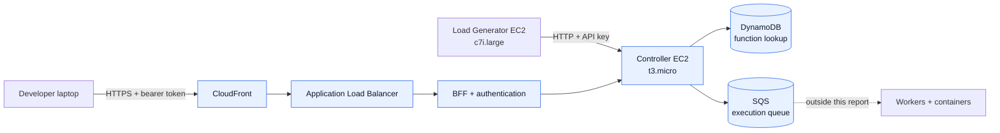
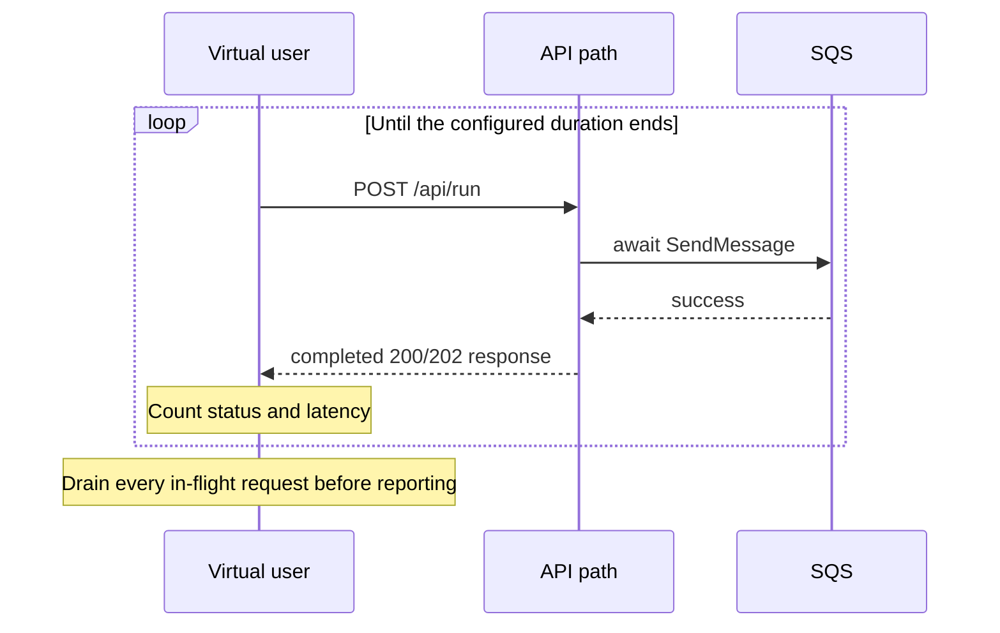
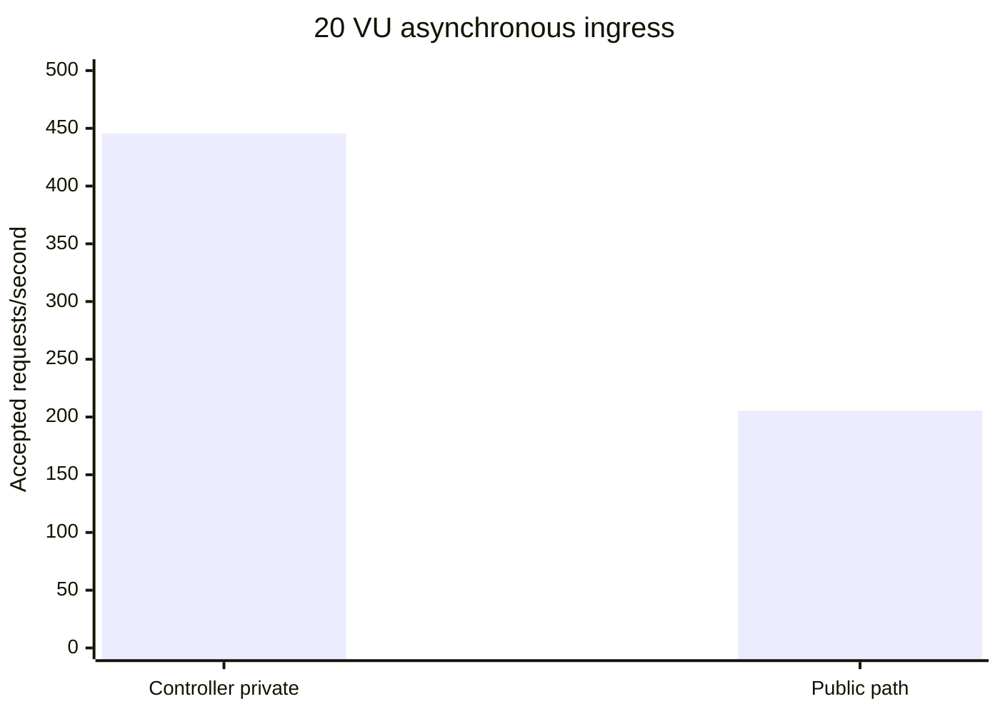

# FaaS Performance and Scalability Verification Report

**Measured:** August 9–10, 2026<br>
**Scope:** asynchronous request admission and separately measured synchronous function completion

## 1. Why this benchmark exists

The platform deliberately separates request admission from function execution with
SQS. A successful ingress request means that the Controller authenticated and
validated the request, looked up the function in DynamoDB, successfully published an
execution message to SQS, and returned a response. It does **not** mean that a Worker
has completed the function.

The benchmark answers two bounded questions:

1. How much asynchronous ingress can one Controller admit through its private API?
2. What throughput and latency remain through the public user-facing path?

Sections 1–7 cover asynchronous admission only. Section 8 and the linked Worker E2E
report cover function completion, queue drain, and submission-to-completion latency
as a separate measurement boundary.

## 2. What was measured



### Success definition

- Private path: completed HTTP `202 Accepted`
- Public path: completed HTTP `200 OK`; the BFF currently normalizes the upstream
  Controller `202` response to `200`
- The load generator counts a request only after its response finishes
- `429`, `5xx`, timeout, and network errors are counted separately as failures

### Controlled conditions

- Function: `Ingress Benchmark` (`3141e3a4-dafe-43b0-8d55-628d1fbc3ddf`)
- Request mode: asynchronous (`x-async: true` behind the BFF)
- Request think time: `0ms`
- Timeout: `5,000ms`
- The SQS queue and DLQ were checked before runs
- Controller rate limiting was temporarily raised from `3,000` to `1,000,000` so
  capacity results were not token-bucket-policy results
- The rate limit was restored to `3,000` after testing

## 3. How it was measured

The previous custom generator incremented its RPS counter when a request was started
and did not wait for in-flight requests before exiting. That number represented
offered load rather than completed throughput.

The revised generator uses a closed workload model:



The implementation is in
[`application/backend/scripts/stress_test.js`](./application/backend/scripts/stress_test.js).
The optional Terraform-managed load generator is isolated from the Controller and
accesses port `8080` through a security-group reference, not a public ingress rule.

## 4. Results

### 4.1 Private Controller ingress

| Concurrency | Duration | Completed | Accepted RPS | Success | Average | p95 | p99 |
|---:|---:|---:|---:|---:|---:|---:|---:|
| 1 VU | 30s | 2,205 | 73.48 | 100% | 13.53ms | 16.26ms | 33.74ms |
| **20 VU** | **10s** | **4,466** | **445.57** | **100%** | **44.78ms** | **71.15ms** | **105.52ms** |
| 30 VU | 10s | 4,077 | 406.54 | 100% | 73.66ms | 120.22ms | 156.25ms |
| 50 VU | 10s | 4,270 | 424.06 | 100% | 117.48ms | 173.88ms | 361.49ms |

Throughput did not improve above 20 VUs, while average and tail latency increased.
This identifies the 20–50 VU range as a saturation region for this Controller and
test path. The strongest defensible statement is therefore:

> One Controller admitted 445.57 requests/second for 10 seconds at 20 VUs with a
> 100% HTTP admission success rate and 71.15ms p95 latency.

This is the highest **short-run measured** result, not a long-duration maximum.

### 4.2 Public service path

| Concurrency | Duration | Completed | Accepted RPS | HTTP success | Average | p95 | p99 |
|---:|---:|---:|---:|---:|---:|---:|---:|
| 20 VU | 10s | 2,077 | 205.64 | 100% | 96.46ms | 193.93ms | 263.99ms |
| **20 VU** | **60s** | **13,981** | **232.74** | **100%** | **85.80ms** | **175.03ms** | **262.87ms** |

The 60-second run is the sustained public-path result:

> The public CloudFront–ALB–BFF–Controller path admitted 13,981 asynchronous
> requests over 60 seconds at 232.74 requests/second, with 100% HTTP admission
> success and 175.03ms p95 latency.

### 4.3 Path comparison

The comparable 20-VU short runs show the cost of the public path:



- Short-run throughput: `445.57 → 205.64 RPS` (**53.8% lower**)
- p95 latency: `71.15 → 193.93ms` (**2.73x higher**)
- Added path: internet/TLS, CloudFront, ALB, BFF proxying, and user authentication

This comparison isolates the aggregate cost of those layers; it does not attribute
the difference to one component without component-level profiling.

## 5. What the results mean

### Proven

- The Controller can admit asynchronous work faster than Workers need to execute it.
- SQS decouples admission from execution and absorbs the difference as backlog.
- The private Controller path completed 4,466 admissions without an HTTP failure in
  the best short run.
- The public path sustained 232.74 accepted RPS for 60 seconds with no HTTP admission
  failures.
- The Controller and BFF remained healthy after the sustained run, and the DLQ was
  empty at the post-test check.

### Not proven by the ingress measurements above

- Worker function executions per second; these require the separate Section 8 tests
- End-to-end function completion success rate; measured separately in Section 8
- Submission-to-completion latency and queue drain; measured separately in Section 8
- A 650 or 1,400 completed-response RPS result
- A 500x improvement over a comparable baseline

Messages remaining in SQS after a run do not invalidate Controller ingress results:
the measured boundary ends after a successful `SendMessage` and HTTP response. They
do mean that the same run cannot be described as end-to-end function throughput.

## 6. Operational findings

1. **Rate limiting works independently of capacity.** At the default `RATE_LIMIT=3000`,
   the Redis token bucket allows an initial 3,000-request burst and refills at about
   50 requests/second. A 20-VU smoke run produced 3,470 accepted responses and 1,567
   `429` responses, matching that policy. Capacity tests therefore used a temporary
   high limit and restored the default afterward.
2. **The public BFF changes async response semantics.** It currently exposes a
   Controller `202` admission as HTTP `200`. Preserving `202` would make the public API
   contract clearer.
3. **The queue and Workers need separate reporting.** Backlog growth is expected when
   ingress is faster than execution. Worker throughput and drain time are the next
   benchmarks required for a complete system-capacity claim.

## 7. Reproduction

Create the optional load generator:

```bash
terraform -chdir=Infra-terraform apply -var='enable_load_generator=true'
```

Run the private test through SSM:

```bash
TARGET_FUNCTION_ID='<function-id>' \
LOAD_TEST_CONCURRENCY=20 \
LOAD_TEST_DURATION=10 \
/opt/faas-load-test/run-private.sh
```

Run the public test from an external client:

```bash
LOAD_TEST_AUTH_TOKEN='<bearer-token>' \
LOAD_TEST_PROTOCOL=https \
LOAD_TEST_TARGET_HOST='<cloudfront-domain>' \
LOAD_TEST_TARGET_PORT=443 \
LOAD_TEST_PATH=/api/run \
TARGET_FUNCTION_ID='<function-id>' \
LOAD_TEST_CONCURRENCY=20 \
LOAD_TEST_DURATION=60 \
node application/backend/scripts/stress_test.js
```

Remove the temporary generator after testing:

```bash
terraform -chdir=Infra-terraform apply -var='enable_load_generator=false'
```

## 8. Worker completion verification

The asynchronous ingress figures above are complemented by public synchronous E2E
tests of actual function completion on one `t3.micro` Worker.

| Offered load | Duration | Completed result | Worker latency | Public E2E latency | Verdict |
|---:|---:|---:|---:|---:|---|
| 1 RPS | 60s | 61/61 successful | avg 430.81ms, p95 479ms | avg 602.65ms, p95 779.73ms | Stable baseline |
| **3 RPS** | **60s** | **181/181 successful, no drops** | **avg 602.4ms, p95 809ms** | **avg 1.24s, p95 1.67s** | **Highest verified stable rate** |
| 7 RPS | 30s | 161 Worker completions; 156 before client timeout, 49 not started | avg 988.74ms, p95 1.09s | avg 12.09s, p95 27.13s | Overload |

At 7 offered RPS, the Worker still completed every started execution, but synchronous
requests accumulated until five exceeded the client timeout and k6 dropped 49
iterations before start. The result identifies saturation near 3.1 completed
responses/second; it is not a stable 7 RPS capacity claim.

Temporary phase profiling over 91 successful executions at 3 RPS attributed the
783.46ms full Worker lifecycle average primarily to container command execution
(401.83ms), process-baseline validation (126.56ms), trusted runner/SDK injection
(113.97ms), and output collection (107.34ms). Slot wait, container acquisition, and
direct cgroup reads were negligible. The integrity controls were retained after the
measurement.

Full conditions, historical comparison, cross-checks, and interpretation are in the
[single-Worker E2E report](./tests/results/2026-08-10-worker-e2e-report.md).
