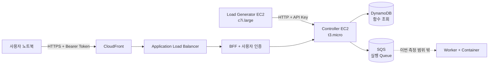
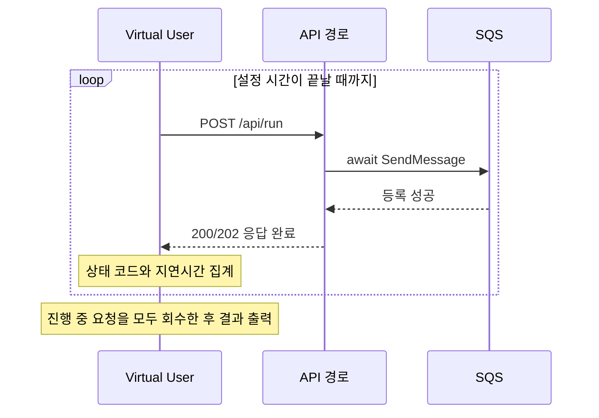
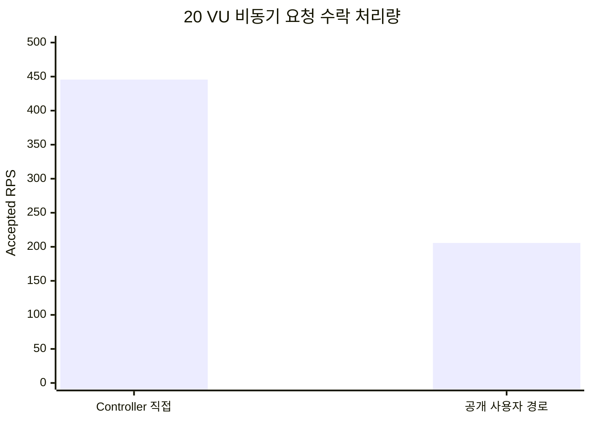

# Controller Ingress 성능 측정 보고서

**측정일:** 2026년 8월 10일 
**측정 범위:** 함수 실행 완료가 아닌 비동기 요청 수락 성능

## 1. 왜 측정했는가

이 플랫폼은 SQS를 이용해 요청 수락과 함수 실행을 분리한다. Ingress 성공은
Controller가 인증과 요청 검증, DynamoDB 함수 조회, SQS 메시지 등록을 완료하고
응답했다는 의미다. Worker가 함수를 실행 완료했다는 의미는 아니다.

이번 측정은 다음 질문에 답하기 위해 수행했다.

1. 단일 Controller가 사설 API에서 초당 몇 건의 비동기 요청을 수락하는가?
2. 실제 공개 사용자 경로를 거친 후 처리량과 지연시간은 얼마인가?

Worker 완료 처리량, Queue drain time, 제출부터 실행 완료까지의 지연은 별도 측정
대상이며 이 보고서의 성과에 포함하지 않는다.

## 2. 무엇을 측정했는가

### 성공 기준

- 사설 직접 경로: 완료된 HTTP `202 Accepted`
- 공개 경로: 완료된 HTTP `200 OK`
  - 현재 BFF가 Controller의 `202`를 외부 응답 `200`으로 변환한다.
- 요청을 시작한 시점이 아니라 응답을 끝까지 수신한 시점에 성공으로 집계
- `429`, `5xx`, timeout, network error는 실패로 분리

### 통제 조건

- 함수: `Ingress Benchmark` (`3141e3a4-dafe-43b0-8d55-628d1fbc3ddf`)
- 호출 방식: 비동기
- Think time: `0ms`
- Timeout: `5,000ms`
- 테스트 전 SQS와 DLQ 상태 확인
- 용량 측정 중 Controller Rate Limit을 `3,000`에서 `1,000,000`으로 임시 상향
- 측정 종료 후 Rate Limit을 `3,000`으로 복구

## 3. 어떻게 측정했는가

기존 자체 스크립트는 요청을 시작할 때 RPS를 증가시키고 진행 중 요청의 완료를
기다리지 않았다. 따라서 과거의 650/1,400 RPS는 완료 처리량이 아니라 Offered Load로
해석해야 한다.

수정한 스크립트는 VU별로 응답을 기다린 후 다음 요청을 전송하며, 종료 전 모든 진행 중
요청을 회수한다.

계측 구현은
[`application/backend/scripts/stress_test.js`](./application/backend/scripts/stress_test.js)에
있다. Terraform으로 생성한 별도 Load Generator는 Controller와 CPU를 공유하지 않으며,
Security Group 참조를 통해 사설 `8080` 포트에만 접근한다.

## 4. 측정 결과

### 4.1 Controller 사설 직접 경로

| 동시성 | 시간 | 완료 응답 | Accepted RPS | 성공률 | 평균 | p95 | p99 |
|---:|---:|---:|---:|---:|---:|---:|---:|
| 1 VU | 30초 | 2,205 | 73.48 | 100% | 13.53ms | 16.26ms | 33.74ms |
| **20 VU** | **10초** | **4,466** | **445.57** | **100%** | **44.78ms** | **71.15ms** | **105.52ms** |
| 30 VU | 10초 | 4,077 | 406.54 | 100% | 73.66ms | 120.22ms | 156.25ms |
| 50 VU | 10초 | 4,270 | 424.06 | 100% | 117.48ms | 173.88ms | 361.49ms |

20 VU 이상에서는 처리량이 증가하지 않고 평균 및 tail latency만 상승했다. 따라서
20~50 VU 구간에서 Controller가 포화 영역에 진입한 것으로 해석할 수 있다.

> 단일 Controller 사설 직접 경로에서 20 VU·10초 조건으로 445.57 accepted RPS,
> HTTP 수락 성공률 100%, p95 71.15ms를 확인했다.

이는 단기 실측 최고값이며 최대 지속 처리량을 의미하지 않는다.

### 4.2 공개 사용자 경로

| 동시성 | 시간 | 완료 응답 | Accepted RPS | HTTP 성공률 | 평균 | p95 | p99 |
|---:|---:|---:|---:|---:|---:|---:|---:|
| 20 VU | 10초 | 2,077 | 205.64 | 100% | 96.46ms | 193.93ms | 263.99ms |
| **20 VU** | **60초** | **13,981** | **232.74** | **100%** | **85.80ms** | **175.03ms** | **262.87ms** |

60초 결과를 공개 경로의 지속 안정성 지표로 사용한다.

> CloudFront–ALB–BFF–Controller 공개 경로에서 20 VU를 60초간 유지하여 총
> 13,981건을 실패 없이 수락했다. 평균 232.74 accepted RPS, HTTP 수락 성공률
> 100%, p95 175.03ms를 기록했다.

### 4.3 경로별 차이

동일한 20 VU·10초 조건을 비교하면:

- 처리량: `445.57 → 205.64 RPS`로 **53.8% 감소**
- p95: `71.15 → 193.93ms`로 **2.73배 증가**
- 추가 구간: 인터넷/TLS, CloudFront, ALB, BFF proxy, 사용자 인증

이 비교는 공개 계층 전체의 합산 오버헤드를 보여준다. 개별 구성 요소의 기여도는 별도
프로파일링 없이는 단정하지 않는다.

## 5. 무엇을 검증했는가

### 검증된 내용

- SQS를 통해 요청 수락과 함수 실행 속도가 분리된다.
- Controller 직접 경로의 단기 최고 실측값은 445.57 accepted RPS다.
- 공개 경로는 60초간 232.74 accepted RPS와 HTTP 수락 성공률 100%를 유지했다.
- 지속 테스트 후 Controller와 BFF가 정상 상태를 유지했다.
- 지속 테스트 직후 DLQ는 0건이었다.

### 이 보고서로 검증하지 않은 내용

- Worker 함수 실행 완료 TPS
- 함수 실행 성공률
- 제출부터 실행 완료까지의 end-to-end latency
- Queue drain time
- 완료 응답 기준 650/1,400 RPS
- 동일 조건 기준 500배 성능 개선

테스트 종료 후 SQS에 메시지가 남는 것은 Controller Ingress 결과를 무효화하지 않는다.
Controller 측정 경계는 `SendMessage` 성공 및 HTTP 응답까지이기 때문이다. 다만 해당
결과를 시스템 전체 함수 실행 처리량으로 표현해서는 안 된다.

## 6. 운영상 발견 사항

1. **Rate Limit 정책과 물리 용량을 분리해야 한다.** 기본 `RATE_LIMIT=3000`은 초기
   3,000 token과 초당 약 50 token을 제공한다. 정책 검증 테스트에서 3,470건이
   수락되고 1,567건이 `429`로 거절돼 의도한 동작을 확인했다.
2. **BFF가 비동기 상태 코드를 변경한다.** Controller의 `202`를 공개 API에서 `200`으로
   반환한다. 비동기 계약을 명확하게 하려면 `202` 전달이 적합하다.
3. **Worker 결과를 별도로 계측해야 한다.** Ingress보다 실행이 느리면 backlog가 쌓이는
   것은 정상이다. 시스템 전체 성능을 설명하려면 Worker 완료 TPS와 drain time이 필요하다.

## 7. 포트폴리오용 성과 문구

> SQS 기반 비동기 구조로 요청 수락과 함수 실행을 분리하고, 완료 응답 기반 부하
> 계측기를 구축했다. 단일 Controller 사설 경로에서 20 VU 단기 부하 기준 445.57
> accepted RPS, 공개 서비스 전체 경로에서 20 VU·60초 기준 232.74 accepted RPS,
> HTTP 수락 성공률 100%, p95 175.03ms의 지속 안정성을 검증했다.
