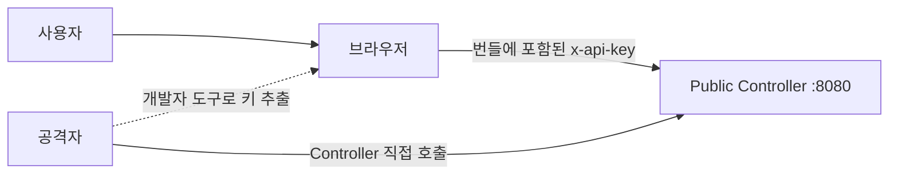
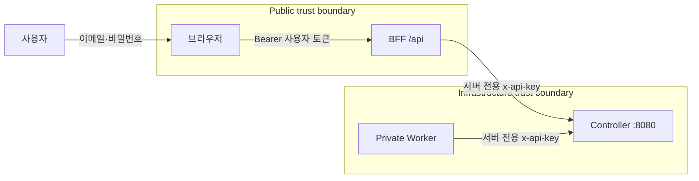
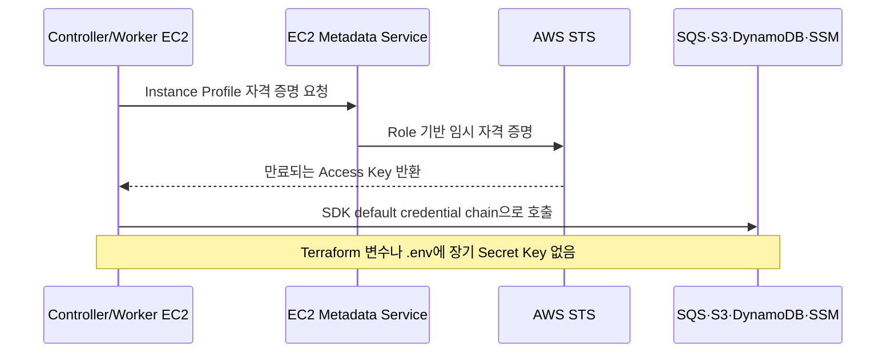
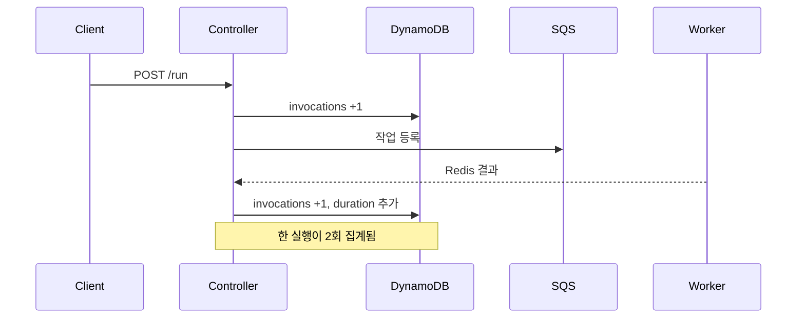
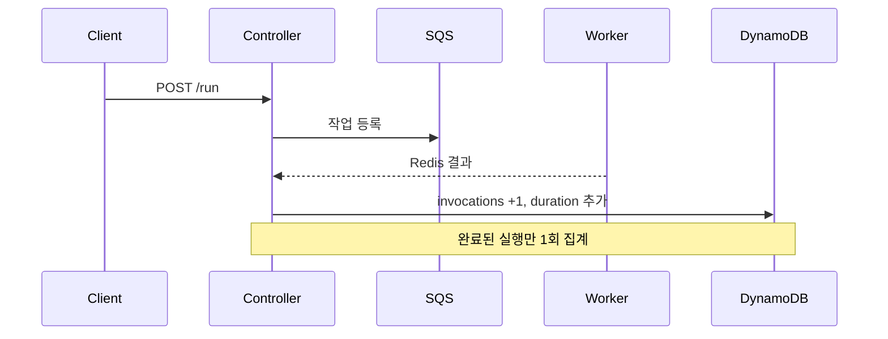
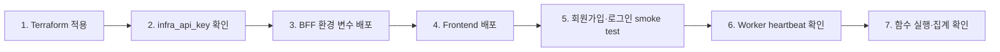

# FaaS Platform 보안·신뢰성 개선 기록

이 문서는 2026년 8월 코드 점검에서 발견한 문제를 **왜 고쳤는지**, **무엇을
바꿨는지**, **어떻게 동작하는지** 중심으로 설명한다. 구현 위치와 검증 결과,
배포 시 필요한 설정도 함께 기록한다.

## 1. 한눈에 보는 변경 이유

| 영역 | 왜 필요한가 | 무엇을 바꿨나 | 기대 결과 |
|---|---|---|---|
| 함수 컨테이너 | 공식 런타임 이미지에 `appuser`가 없어 실행이 실패할 수 있었다 | 공통 UID 65534 실행, capability 제거, PID 제한, `no-new-privileges`, tmpfs 작업공간 적용 | 공식 이미지 호환성과 격리 수준 향상 |
| Controller API | heartbeat와 운영 상태 API가 인증 없이 노출됐다 | heartbeat·worker status·system status·model API에 공유 키 인증 적용 | 가짜 워커 등록과 운영 정보 노출 차단 |
| 브라우저/BFF 경계 | `VITE_API_KEY`는 빌드 결과에 포함되므로 비밀이 아니었다 | 브라우저에서 인프라 키 제거, BFF만 Controller 키 보유 | Controller 자격 증명을 서버 경계 안에 유지 |
| AWS 인증 | 장기 Access/Secret Key가 Terraform state와 EC2 `.env`에 남았다 | EC2 Instance Profile 사용, 장기 키 변수와 user-data 주입 제거 | 키 유출 범위 축소와 자동 자격 증명 순환 |
| 통계·로그 | 한 실행이 요청 시점과 완료 시점에 두 번 집계됐다 | 완료 이벤트에서만 invocation 집계, 로그 조회 pagination 적용 | 호출 수·평균 시간이 실제 완료 실행과 일치 |
| 사용자 인증 | UI는 로그인 화면이 있었지만 BFF 라우트와 보호 로직이 없었다 | scrypt 비밀번호 저장, 서명 토큰, 인증 middleware, 보호 라우트 구현 | UI 표시가 아닌 실제 서버 측 접근 제어 |
| timeout 정리 | timeout 후 스트림 스레드가 삭제된 작업공간을 쓸 수 있었다 | 컨테이너 중지 후 스트림 종료를 기다리도록 변경 | workspace cleanup race 방지 |

## 2. 신뢰 경계: 왜 BFF가 키를 가져야 하는가

브라우저 환경 변수는 사용자에게 전달되는 JavaScript에 포함된다. 따라서
`VITE_API_KEY`를 Controller 인증 키로 사용하면 키를 공개하는 것과 같다.

### 변경 전



### 변경 후



### 어떻게 동작하는가

1. 회원가입 시 BFF가 비밀번호를 Node.js `scrypt`로 해시한다.
2. 로그인 성공 시 BFF가 HMAC-SHA256 서명 토큰을 발급한다.
3. 브라우저는 이후 요청에 `Authorization: Bearer <token>`만 전송한다.
4. BFF middleware가 토큰의 서명·만료·사용자 존재 여부를 확인한다.
5. 검증된 요청만 BFF가 서버 환경의 `INFRA_API_KEY`를 붙여 Controller로 전달한다.

> 현재 사용자 저장소는 `auth-users.json` 단일 파일이다. 단일 BFF 데모에는
> 적합하지만 다중 인스턴스 운영에서는 DynamoDB, RDS 같은 공유 저장소와 중앙
> 세션 폐기 정책으로 교체해야 한다.

## 3. 함수 실행 격리: 무엇을 막는가

```mermaid
flowchart TD
    Q[SQS 작업] --> A[Worker Agent]
    A --> P{함수별 Warm Pool}
    P --> C[UID 65534 컨테이너]
    C --> WS[/workspace tmpfs]
    C --> OUT[/output tmpfs]

    X1[Linux capabilities] -. 제거 .-> C
    X2[권한 상승] -. no-new-privileges .-> C
    X3[프로세스 폭증] -. PID 128 제한 .-> C
    X4[호스트 영구 경로] -. 직접 mount 없음 .-> C
```

### 왜

- 기존 코드는 공식 Python/Node/GCC/Go 이미지에 없는 `appuser`를 지정했다.
- 메모리와 CPU 외에 capability와 프로세스 수 제한이 없었다.
- 사용자 코드 작업 디렉터리를 컨테이너 수명과 분리할 필요가 있었다.

### 어떻게

- 모든 런타임에 존재하는 numeric UID/GID `65534:65534`를 사용한다.
- `cap_drop=["ALL"]`, `no-new-privileges`, `pids_limit=128`을 적용한다.
- `/workspace`와 `/output`을 `nosuid,nodev` tmpfs로 제공한다.
- timeout이면 컨테이너를 중지하고 스트림 스레드가 닫힌 뒤 host workspace를 정리한다.

AI 함수 호출을 위해 bridge network는 유지한다. 외부 통신 통제는 private subnet과
라우팅 계층에서 담당한다.

## 4. AWS 인증: 장기 키를 없앤 방법



### 무엇

- Terraform AWS provider의 `access_key`, `secret_key` 설정을 제거했다.
- Controller/Worker user-data에서 `AWS_ACCESS_KEY_ID`와
  `AWS_SECRET_ACCESS_KEY`를 제거했다.
- 기존 최소 권한 IAM Role과 Instance Profile을 실제 SDK 인증 경로로 사용한다.
- Controller에도 SSM Core policy를 붙이고 공개 SSH를 VPC 내부로 제한했다.
- 내부 API 키는 `random_password`로 배포마다 생성한다.

Terraform을 실행하는 운영자나 CI 자체는 AWS Profile, SSO 또는 CI의 OIDC Role을
사용해야 한다.

## 5. 호출 집계: 언제 숫자를 올리는가

### 변경 전



### 변경 후



개별 실행 로그는 `requestId`가 sort key가 아니므로 첫 Query 결과에 없을 수 있다.
따라서 `LastEvaluatedKey`가 존재하는 동안 다음 페이지를 조회해 정확한 로그를 찾는다.
장기적으로는 `requestId` GSI를 추가해 조회 비용을 줄이는 것이 좋다.

## 6. 배포 설정

### Terraform 실행 환경

```bash
export AWS_PROFILE=<deployment-profile>
terraform init
terraform plan
terraform apply
```

### BFF 환경 변수

```bash
INFRA_API_KEY=$(terraform output -raw infra_api_key)
AUTH_TOKEN_SECRET=<32자 이상의 별도 랜덤 문자열>
AWS_CONTROLLER_URL=http://<controller-host>:8080
```

`INFRA_API_KEY`와 `AUTH_TOKEN_SECRET`은 절대 `VITE_*` 변수로 전달하지 않는다.

## 7. 검증 결과

| 검증 | 결과 |
|---|---|
| Python 단위 테스트 | 6개 통과 |
| Controller/BFF JavaScript 구문 검사 | 통과 |
| Python AST 검사 | 23개 파일 통과 |
| Frontend production build | 통과 |
| BFF 인증 통합 흐름 | register 201 → anonymous 401 → login 200 → `/auth/me` 200 |
| BFF production dependency audit | 알려진 취약점 0개 |
| `git diff --check` | 통과 |
| Terraform validate | 로컬 Terraform CLI 부재로 미실행 |

Frontend audit에는 React Router RSC 기능 관련 high 경고 2개가 남아 있다. 이
프로젝트는 client-only `BrowserRouter`를 사용해 해당 서버 기능을 실행하지 않지만,
패치 버전이 제공되면 lockfile을 갱신해야 한다.

## 8. 배포 순서와 확인 지점



확인할 항목:

1. 무인증 `/api/functions` 요청이 BFF에서 401을 반환하는지 확인한다.
2. Worker heartbeat가 Controller에서 200을 받고 `/api/system/status`에 반영되는지 확인한다.
3. 한 번 실행한 함수의 invocation이 정확히 1 증가하는지 확인한다.
4. Python·Node.js·C++·Go 샘플 함수가 UID 65534 환경에서 실행되는지 확인한다.
5. SSM Session Manager 접속 후 EC2 `.env`에 AWS 장기 키가 없는지 확인한다.
