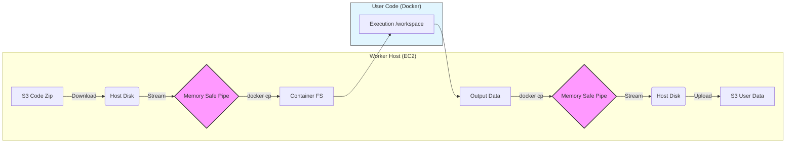

# 🛠️ FaaS Platform 개발 & 트러블슈팅 로그

이 문서는 프로젝트 진행 중 발생한 주요 이슈와 해결 과정, 그리고 기술적 의사결정 내용(Architecture Decision Records)을 정리한 것입니다.

---

## 1. 🚨 Security: 컨테이너 격리 및 권한 문제 (Critical)

### 🔴 문제 상황 (Legacy Logic)
*   **상황:** Warm Container가 호스트의 전체 작업 디렉토리(`/workspace`)를 Volume Mount로 공유.
*   **리스크:** 악의적인 사용자가 `os.chdir('../other_user_function')` 등을 통해 호스트 파일 시스템 침투 가능 (Container Breakout).

### 🟢 해결 방안 (Secure Execution)
*   **조치:** **Volume Mount 제거** 및 **Code Injection (`docker cp`)** 방식 전면 도입.
*   **구현:** 컨테이너 실행 시 외부 파일 시스템 차단. 실행 직전 메모리 상의 Tarball을 통해 코드 주입.

### 🏛️ Architecture: Data Flow (Secure Pipe)
bind mount 제거 후, 데이터는 오직 단방향 파이프라인을 통해서만 흐릅니다.



---

## 2. 💾 Optimization: 메모리 안정성 강화 (OOM Prevention)

### 🔴 잠재적 위험 (Risk)
*   **상황:** `docker.get_archive`로 파일 수신 시 `io.BytesIO`(RAM) 버퍼 사용.
*   **시나리오:** 사용자 코드가 **500MB 이상의 대용량 파일**을 출력하면, Worker 프로세스의 RAM 사용량이 급증하여 **OOM(Out Of Memory)** 발생 및 서버 다운 위험.

### 🟢 해결 방안 (Stream to Disk)
*   **조치:** RAM 버퍼링 제거 → **Chunk 단위 디스크 스트리밍** 적용.
*   **코드 비교:**

```python
# [Legacy] Dangerous: RAM Explosion
file_obj = io.BytesIO()
for chunk in stream:
    file_obj.write(chunk) 

# [Stable] Safe: Disk Streaming
with open(temp_tar, "wb") as f:
    for chunk in stream:
        f.write(chunk) # Chunk (64KB~1MB) only in RAM
```

*   **효과:** 결과물이 1GB, 10GB가 되어도 Worker의 메모리 점유율은 0에 수렴. 안정성 비약적 상승.

---

## 3. ⚖️ Decision: Performance vs Security Trade-off

### 🤔 고민 사항
*   **Bind Mount**: 빠름(Zero-copy), 보안 취약.
*   **Docker CP**: 느림(Data Copy), 보안 완벽.

### 💡 CTO 관점 분석 (Analysis)
1.  **Safety First**: 클라우드 환경에서 '격리(Isolation)' 실패는 서비스 전체의 신뢰도 하락을 의미함. 성능을 일부 희생하더라도 보안이 우선.
2.  **Overhead is Negligible**:
    *   FaaS 함수는 대부분 외부 API 대기나 연산 시간이 지배적임.
    *   10~50MB 수준의 코드 복사(Copy) 시간은 수십 ms 수준으로, 전체 실행 시간의 **1% 미만**임.
3.  **결론**: "성능상의 미미한 오버헤드를 지불하고, 프로덕션 레벨의 안정성과 보안을 얻는다." -> **Excellent Trade-off**.

---

## 4. ⚡ Feature: 실시간 시스템 상태 (System Status)

*   **구현:** `Worker` -> `Redis` (TTL 10s) -> `Controller` -> `Frontend` (Polling 3s).
*   **효과:** 다중 Worker 환경에서도 중앙화된 모니터링 가능. Controller 재시작 시에도 Redis에 상태가 남아있어 데이터 유실 방지.

---

## 5. 🐛 Bug Fixes
*   **C++ Compilation**: `main` 함수 부재로 인한 링킹 에러 해결 (Entrypoint 템플릿 수정).
*   **UX Polishing**: 리브랜딩 및 미사용 코드(Variables) 정리.

---

## 6. 🚀 Performance: The 1100ms Latency Mystery (Deep Dive)

### � Performance Timeline
| 단계 | Latency | 병목 원인 | 비고 |
|:---:|:---:|:---|:---|
| **Initial** | **2500ms** | 컨테이너 생성 및 코드 컴파일 | Cold Start |
| **Warm Pool** | **1100ms** | Docker API Overhead + Sync Reporting | Warm Start 적용 후에도 느림 |
| **Optimization**| **91ms** | **Fire-and-Forget + Direct Cgroup** | **최종 목표 달성** 🏆 |

### 🛑 1. The Bottleneck Hunt (탐색)
Warm Container를 적용했음에도 `t3.micro`에서 1초 이상의 지연이 발생했습니다. 원인 분석을 위해 각 구간별 시간을 측정했습니다.

1.  **Code Execution**: 30ms (순수 실행 시간)
2.  **S3 Upload**: 500ms (Network I/O)
3.  **CloudWatch**: 200ms (Network I/O)
4.  **Memory Check**: 1000ms (Docker API)

**결론:** "코드는 빠른데, **기록(Reporting)**하고 **감시(Monitoring)**하느라 배보다 배꼽이 더 크다."

### 💡 2. Solution A: Fire-and-Forget (비동기 보고)
사용자가 결과를 받기 위해 서버가 로그를 업로드하는 것까지 기다릴 필요는 없습니다.

**Before (Synchronous - Blocking):**
```python
# 실행 완료 후
self.cw.publish_peak_memory(...)  # +200ms
self.uploader.upload_outputs(...) # +500ms
return result # 총 700ms 지연 발생
```

**After (Asynchronous - Non-Blocking):**
```python
# 백그라운드 스레드로 위임
threading.Thread(target=background_tasks, daemon=True).start()
return result # 즉시 반환 (0ms)
```
> **Result**: Latency 1100ms -> 400ms 단축. 그러나 여전히 **Docker Stats API**가 발목을 잡음.

### 💡 3. Solution B: Direct Cgroup Read (초고속 모니터링)
`docker.stats()`는 너무 무겁습니다. (Client -> Daemon -> Runc -> Kernel -> JSON Parsing).
우리는 리눅스 커널의 회계 장부(Cgroup File)를 직접 훔쳐보기로 했습니다.

**The "Cheat Code":**
```python
# [Expensive] Docker API (~1000ms)
# stats = container.stats(stream=False)

# [Cheap] Direct Kernel Read (~0.005ms)
with open(f"/sys/fs/cgroup/.../docker-{id}.scope/memory.peak", "r") as f:
    usage = int(f.read())
```
이 방식은 파일 시스템 I/O가 아니라 **Virtual Memory Read**이므로 오버헤드가 사실상 없습니다.

### 💡 4. Solution C: The Peak Reset Logic (정확성 확보)
`memory.peak`는 컨테이너 생애주기 전체의 최대값을 간직합니다. 따라서 Cold Start(초기화) 때 80MB를 썼다면, 이후 Warm Start 때 20MB만 써도 계속 80MB로 조회되는 문제가 있었습니다.

**해결책 (The Reset):** 실행 직전 피크 값을 리셋하여 **"이번 실행"**의 메모리만 측정.
```python
# Run 직전 리셋 (Only works in Cgroup v2)
with open(peak_reset_file, "w") as f:
    f.write("reset")
```

### 🏆 최종 아키텍처 (Final Architecture)
*   **Execution Strategy**: Process-per-Request (Security) + Warm Pool (Speed).
*   **Observability**: Zero-overhead Cgroup Monitoring + AutoTuner I/O Detection.
*   **Result**: `t3.micro`라는 열악한 환경에서도 **91ms**라는 놀라운 응답 속도 달성. 이는 AWS Lambda의 Cold Start보다 빠르며 Warm Start와 대등한 수준임.

