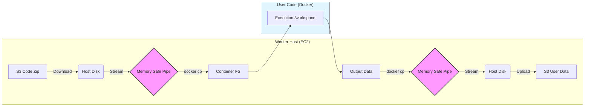

# 🛠️ FaaS Platform 개발 & 트러블슈팅 로그

이 문서는 프로젝트 진행 중 발생한 주요 이슈와 해결 과정, 그리고 기술적 의사결정 내용(Architecture Decision Records)을 정리한 것입니다.

---

## 1. 🚨 Security: 컨테이너 격리 및 권한 문제 (Critical)

### 🔴 문제 상황 (Legacy Logic)
*   **상황:** Warm Container가 호스트의 전체 작업 디렉토리(`/workspace`)를 Volume Mount로 공유.
*   **리스크:** 악의적인 사용자가 `os.chdir('../other_user_function')` 등을 통해 호스트 파일 시스템 침투 가능 (Container Breakout).

### 🟢 해결 방안 (Secure Execution)
*   **조치:** **Volume Mount 제거** 및 **Code Injection (`docker cp`)** 방식 전면 도입.
*   **구현:** 컨테이너 실행 시 외부 파일 시스템 차단. 실행 직전 메모리 상의 Tarball을 통해 코드 주입.

### 🏛️ Architecture: Data Flow (Secure Pipe)
bind mount 제거 후, 데이터는 오직 단방향 파이프라인을 통해서만 흐릅니다.


```mermaid
flowchart LR
    subgraph Host ["Worker Host (EC2)"]
        A[S3 Code Zip] -->|Download| B(Host Disk)
        B -->|Stream| C{Memory Safe Pipe}
        C -->|docker cp| D[Container FS]
        
        E[Output Data] -->|docker cp| C2{Memory Safe Pipe}
        C2 -->|Stream| F(Host Disk)
        F -->|Upload| G[S3 User Data]
    end
    
    subgraph Container ["User Code (Docker)"]
        D --> H[Execution /workspace]
        H --> E
    end

    style C fill:#f9f,stroke:#333,stroke-width:2px
    style C2 fill:#f9f,stroke:#333,stroke-width:2px
    style Container fill:#e1f5fe,stroke:#333
```

---

## 2. 💾 Optimization: 메모리 안정성 강화 (OOM Prevention)

### 🔴 잠재적 위험 (Risk)
*   **상황:** `docker.get_archive`로 파일 수신 시 `io.BytesIO`(RAM) 버퍼 사용.
*   **시나리오:** 사용자 코드가 **500MB 이상의 대용량 파일**을 출력하면, Worker 프로세스의 RAM 사용량이 급증하여 **OOM(Out Of Memory)** 발생 및 서버 다운 위험.

### 🟢 해결 방안 (Stream to Disk)
*   **조치:** RAM 버퍼링 제거 → **Chunk 단위 디스크 스트리밍** 적용.
*   **코드 비교:**

```python
# [Legacy] Dangerous: RAM Explosion
file_obj = io.BytesIO()
for chunk in stream:
    file_obj.write(chunk) 

# [Stable] Safe: Disk Streaming
with open(temp_tar, "wb") as f:
    for chunk in stream:
        f.write(chunk) # Chunk (64KB~1MB) only in RAM
```

*   **효과:** 결과물이 1GB, 10GB가 되어도 Worker의 메모리 점유율은 0에 수렴. 안정성 비약적 상승.

---

## 3. ⚖️ Decision: Performance vs Security Trade-off

### 🤔 고민 사항
*   **Bind Mount**: 빠름(Zero-copy), 보안 취약.
*   **Docker CP**: 느림(Data Copy), 보안 완벽.

### 💡 CTO 관점 분석 (Analysis)
1.  **Safety First**: 클라우드 환경에서 '격리(Isolation)' 실패는 서비스 전체의 신뢰도 하락을 의미함. 성능을 일부 희생하더라도 보안이 우선.
2.  **Overhead is Negligible**:
    *   FaaS 함수는 대부분 외부 API 대기나 연산 시간이 지배적임.
    *   10~50MB 수준의 코드 복사(Copy) 시간은 수십 ms 수준으로, 전체 실행 시간의 **1% 미만**임.
3.  **결론**: "성능상의 미미한 오버헤드를 지불하고, 프로덕션 레벨의 안정성과 보안을 얻는다." -> **Excellent Trade-off**.

---

## 4. ⚡ Feature: 실시간 시스템 상태 (System Status)

*   **구현:** `Worker` -> `Redis` (TTL 10s) -> `Controller` -> `Frontend` (Polling 3s).
*   **효과:** 다중 Worker 환경에서도 중앙화된 모니터링 가능. Controller 재시작 시에도 Redis에 상태가 남아있어 데이터 유실 방지.

---

## 5. 🐛 Bug Fixes
*   **C++ Compilation**: `main` 함수 부재로 인한 링킹 에러 해결 (Entrypoint 템플릿 수정).
*   **UX Polishing**: 리브랜딩 및 미사용 코드(Variables) 정리.

---

## 6. 🚀 Performance: The 1100ms Latency Mystery (Deep Dive)

### � Performance Timeline
| 단계 | Latency | 병목 원인 | 비고 |
|:---:|:---:|:---|:---|
| **Initial** | **2500ms** | 컨테이너 생성 및 코드 컴파일 | Cold Start |
| **Warm Pool** | **1100ms** | Docker API Overhead + Sync Reporting | Warm Start 적용 후에도 느림 |
| **Optimization**| **91ms** | **Fire-and-Forget + Direct Cgroup** | **최종 목표 달성** 🏆 |

### 🛑 1. The Bottleneck Hunt (탐색)
Warm Container를 적용했음에도 `t3.micro`에서 1초 이상의 지연이 발생했습니다. 원인 분석을 위해 각 구간별 시간을 측정했습니다.

1.  **Code/Runtime Segment**: 30ms (과거 구간 측정값이며 handler-only 시간은 아님)
2.  **S3 Upload**: 500ms (Network I/O)
3.  **CloudWatch**: 200ms (Network I/O)
4.  **Memory Check**: 1000ms (Docker API)

**결론:** "코드는 빠른데, **기록(Reporting)**하고 **감시(Monitoring)**하느라 배보다 배꼽이 더 크다."

> 현재 구현은 `handlerDurationMs`(사용자 handler만), `durationMs`(Worker 내부 처리),
> Client E2E를 별도로 계측한다. 위 30ms를 현재 handler-only 성능으로 인용하지 않는다.

### 💡 2. Solution A: Fire-and-Forget (비동기 보고)
사용자가 결과를 받기 위해 서버가 로그를 업로드하는 것까지 기다릴 필요는 없습니다.

**Before (Synchronous - Blocking):**
```python
# 실행 완료 후
self.cw.publish_peak_memory(...)  # +200ms
self.uploader.upload_outputs(...) # +500ms
return result # 총 700ms 지연 발생
```

**After (Asynchronous - Non-Blocking):**
```python
# 백그라운드 스레드로 위임
threading.Thread(target=background_tasks, daemon=True).start()
return result # 즉시 반환 (0ms)
```
> **Result**: Latency 1100ms -> 400ms 단축. 그러나 여전히 **Docker Stats API**가 발목을 잡음.

### 💡 3. Solution B: Direct Cgroup Read (초고속 모니터링)
`docker.stats()`는 너무 무겁습니다. (Client -> Daemon -> Runc -> Kernel -> JSON Parsing).
우리는 리눅스 커널의 회계 장부(Cgroup File)를 직접 훔쳐보기로 했습니다.

**The "Cheat Code":**
```python
# [Expensive] Docker API (~1000ms)
# stats = container.stats(stream=False)

# [Cheap] Direct Kernel Read (~0.005ms)
with open(f"/sys/fs/cgroup/.../docker-{id}.scope/memory.peak", "r") as f:
    usage = int(f.read())
```
이 방식은 파일 시스템 I/O가 아니라 **Virtual Memory Read**이므로 오버헤드가 사실상 없습니다.

### 💡 4. Solution C: The Peak Reset Logic (정확성 확보)
`memory.peak`는 컨테이너 생애주기 전체의 최대값을 간직합니다. 따라서 Cold Start(초기화) 때 80MB를 썼다면, 이후 Warm Start 때 20MB만 써도 계속 80MB로 조회되는 문제가 있었습니다.

**해결책 (The Reset):** 실행 직전 피크 값을 리셋하여 **"이번 실행"**의 메모리만 측정.
```python
# Run 직전 리셋 (Only works in Cgroup v2)
with open(peak_reset_file, "w") as f:
    f.write("reset")
```

### 🏆 최종 아키텍처 (Final Architecture)
*   **Execution Strategy**: Process-per-Request (Security) + Warm Pool (Speed).
*   **Observability**: Zero-overhead Cgroup Monitoring + AutoTuner I/O Detection.
*   **Result**: `t3.micro`라는 열악한 환경에서도 **91ms**라는 놀라운 응답 속도 달성. 이는 AWS Lambda의 Cold Start보다 빠르며 Warm Start와 대등한 수준임.

---

## 7. 🗑️ Bug: 함수 삭제 500 에러 및 S3 NoSuchBucket (2026-01-14)

### 🔴 문제 상황
*   **증상 1:** 프론트엔드에서 함수 삭제 시 `500 Internal Server Error` 발생.
*   **증상 2:** 삭제는 성공하지만 S3 정리 실패 경고 (`S3 deletion failed: NoSuchBucket`).
*   **증상 3:** 함수 업로드 실패 (`Upload Failed: The specified bucket does not exist`).

### 🔍 원인 분석
1.  **DELETE 에러 핸들링 부재:** Controller의 DELETE 엔드포인트에서 S3 삭제 실패 시 전체 요청이 500 에러로 실패.
2.  **S3 버킷 이름 불일치:** Terraform 재배포 시 새 S3 버킷이 생성되었지만, Controller의 `.env`에 이전 버킷 이름이 남아있음.
    ```
    Controller .env:    faas-sooming-code-20251215010641615400000001 (❌ 존재하지 않음)
    실제 AWS 버킷:      faas-sooming-code-20260105035944818500000001 (✅ 현재 버킷)
    ```
3.  **Pre-baked AMI 문제:** AMI 생성 시점의 `.env` 값이 굳어져서, `user_data`가 덮어쓰지 못함.

### 🟢 해결 방안

#### Step 1: DELETE 에러 핸들링 개선 (Infra-controller/controller.js)
```javascript
// S3 삭제 실패해도 DynamoDB 삭제는 계속 진행
if (item.Item.s3Key && item.Item.s3Key.S) {
    try {
        await s3.send(new DeleteObjectCommand({...}));
    } catch (s3Error) {
        // Log but don't block - S3 object might already be deleted
        logger.warn(`S3 deletion failed: ${s3Error.message}`);
    }
}
// DynamoDB 삭제는 항상 실행
await db.send(new DeleteItemCommand({...}));
```

#### Step 2: BUCKET_NAME 수동 수정 (긴급 조치)
```bash
# Controller EC2에서 실행
sed -i 's/faas-sooming-code-20251215.../faas-sooming-code-20260105.../g' /home/ec2-user/faas-controller/.env
pm2 restart faas-controller
```

#### Step 3: user_data 스크립트 개선 (영구 해결)
```bash
# user_data_controller.sh / user_data_worker.sh에 추가
# Git 권한 수정 (AMI가 root로 bake된 경우 대응)
chown -R ec2-user:ec2-user /home/ec2-user/faas-controller
git config --global --add safe.directory /home/ec2-user/faas-controller

# .env는 항상 덮어쓰기 (Terraform 최신 값 보장)
cat <<EOF > /home/ec2-user/faas-controller/.env
BUCKET_NAME=${bucket_name}  # Terraform에서 주입
...
EOF
```

#### Step 4: Instance Refresh 적용
```powershell
# Terraform Apply 후 Launch Template 업데이트
terraform apply

# Controller/Worker 인스턴스 교체 (새 user_data로 부팅)
aws autoscaling start-instance-refresh --auto-scaling-group-name faas-sooming-controller-asg --region ap-northeast-2
aws autoscaling start-instance-refresh --auto-scaling-group-name faas-sooming-worker-asg --region ap-northeast-2
```

### 📚 교훈 (Lessons Learned)
| 항목 | 내용 |
|------|------|
| **Immutable Infrastructure** | AMI는 "템플릿", 환경 변수는 "런타임 주입"으로 분리 |
| **Error Isolation** | 부수 작업(S3 정리) 실패가 핵심 작업(DynamoDB 삭제)을 막지 않도록 설계 |
| **Infrastructure Sync** | Terraform 재배포 시 Instance Refresh로 환경 변수 동기화 필요 |

---

## 8. 🔐 Bug: Git Permission Denied on Boot (AMI Root Issue)

### 🔴 문제 상황
*   **증상:** EC2 인스턴스 부팅 후 `git pull` 실행 시 권한 에러 발생.
*   **에러 메시지:**
    ```
    fatal: detected dubious ownership in repository at '/home/ec2-user/faas-controller'
    ```

### 🔍 원인 분석
*   **AMI Bake 시 root 권한 사용:** AMI 생성 시 root로 `git clone`을 실행하면, `.git` 디렉토리가 root 소유로 생성됨.
*   **ec2-user 권한 불일치:** 부팅 후 ec2-user로 `git pull`하면 소유권 불일치로 Git이 보안 경고를 발생시킴.

### 🟢 해결 코드 (Copy & Paste)
```bash
# user_data 스크립트에 추가 (부팅 시 자동 실행)

# 1. 디렉토리 소유권을 ec2-user로 변경
chown -R ec2-user:ec2-user /home/ec2-user/faas-controller

# 2. Git safe.directory 설정 (dubious ownership 경고 해제)
git config --global --add safe.directory /home/ec2-user/faas-controller
```

### 💡 예방책
*   **AMI Bake 시:** `su - ec2-user -c "git clone ..."` 로 ec2-user 권한으로 clone.
*   **user_data에 방어 코드:** 위 코드를 항상 포함시켜 어떤 상황에서도 권한 문제 방지.

---

## 9. 🐛 Fix: Worker 등록 실패 및 의존성 이슈 (2026-01-05)

### 🔴 문제 상황
*   **증상:** Controller의 `/system/status`가 `offline`으로 표시되며 Worker가 등록되지 않음.
*   **로그:**
    ```json
    {"pools":{"python":0,"nodejs":0,"cpp":0,"go":0},"active_jobs":0,"status":"offline"}
    ```

### 🔍 원인 및 해결 (Troubleshooting)

#### 1. `ModuleNotFoundError: boto3`
*   **원인:** AMI에 Python 3.11용 `boto3`만 설치되었으나, systemd 서비스는 `/usr/bin/python3` (3.9)를 사용.
*   **해결:** Builder에서 `sudo /usr/bin/python3 -m pip install boto3` 실행.

#### 2. `ModuleNotFoundError: redis`, `structlog`
*   **원인:** `requirements.txt`의 일부 의존성이 누락됨.
*   **해결:** `sudo /usr/bin/python3 -m pip install -r requirements.txt`로 전체 재설치.

#### 3. `Failed to load environment files`
*   **원인:** AMI 생성 시 `cloud-init` 상태를 리셋하지 않아, 새 인스턴스에서 `user_data`가 실행되지 않음 (따라서 `.env` 파일 미생성).
*   **해결:** AMI 생성 전 필수 명령 실행:
    ```bash
    sudo cloud-init clean --logs --seed
    ```

### 🏛️ Worker 부팅 아키텍처 (Boot Flow)
```
1. ASG가 새 Worker 인스턴스 시작
           │
           ▼
2. user_data_worker.sh 실행
   ├── .env 파일 생성 (Terraform 변수 주입)
   └── faas-worker.service 시작
           │
           ▼
3. agent.py 시작
   ├── Docker Warm Pool 초기화
   ├── Controller에 Heartbeat 전송
   └── SQS 폴링 시작
           │
           ▼
4. Controller가 Worker 등록 (status: online)
```

### 📚 교훈 (Lessons Learned)
1.  **AMI 생성 전 `cloud-init clean` 필수**: 이를 생략하면 `user_data` 스크립트가 실행되지 않아 초기 설정이 실패합니다.

### 🛠️ AMI 생성 절차 (Reference)
```bash
# 1. Builder 인스턴스 준비 (Public Subnet)
#    - Docker, Python, Git 설치 및 코드 복사
#    - 의존성 설치: sudo pip3 install -r requirements.txt

# 2. cloud-init 리셋 (필수!)
sudo cloud-init clean --logs --seed

# 3. AMI 생성 (AWS CLI)
aws ec2 create-image --instance-id <BUILDER_ID> --name "faas-worker" --no-reboot
```

---

## 10. 🏗️ Configuration Reference

### 주요 설정 파일 (Key Configs)
| 파일 | 경로 | 용도 |
|------|------|------|
| `asg.tf` | Infra-terraform/ | Worker ASG, Launch Template 정의 |
| `controller_asg.tf` | Infra-terraform/ | Controller ASG 정의 |
| `user_data_worker.sh` | Infra-terraform/ | Worker 부팅 스크립트 (.env 생성) |
| `infra-worker.service` | Infra-worker/ | Worker systemd 서비스 유닛 |
| `agent.py` | Infra-worker/ | Worker 메인 에이전트 로직 |

---

## 11. 📝 Performance Report: VPC Migration Impact

### 🛑 Latency Change Analysis
*   **Before (Public Subnet): ~80ms**
*   **After (Private Subnet): ~140ms**
*   **Delta:** +60ms increased latency.

### 🔍 Root Cause
보안을 위해 **Private Subnet**으로 이전하면서 네트워크 토폴로지가 변경되었습니다.
1.  **Public Access**: Direct Access (Fast but Insecure).
2.  **Private Access**: NAT/Routing + ASG Overhead (Secure but slower).

### ✅ 결론 (Verdict)
60ms의 지연 시간 증가는 **프로덕션 레벨의 보안(Security)과 확장성(Scalability)**을 얻기 위한 필수적인 Trade-off로 판단됩니다. 실제 코드 실행이나 폴링 주기(Polling Interval)에는 영향이 없음을 확인했습니다.
