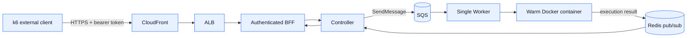
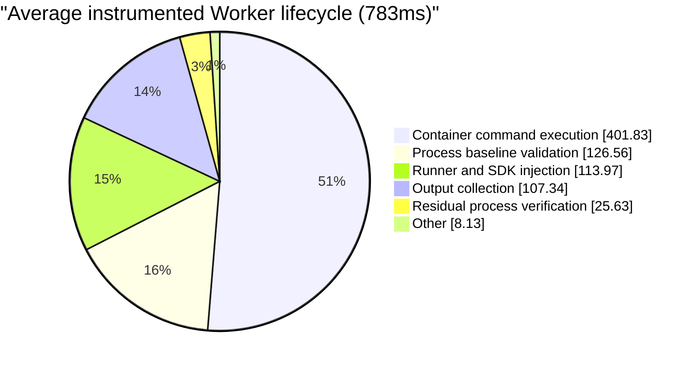

# Single-Worker E2E Verification — 2026-08-10

## Purpose

This report records the post-hardening verification of actual function completions.
It is separate from the asynchronous ingress benchmarks: a request counts only when
the public API receives a successful Worker execution result.

The previous results in [`2026-08-09-e2e-report.md`](./2026-08-09-e2e-report.md)
remain as the pre-hardening baseline.

## Environment and success boundary

```text
k6 on an external macOS client
  -> CloudFront HTTPS
  -> ALB
  -> authenticated Node.js BFF
  -> Controller
  -> SQS
  -> one t3.micro Worker
  -> warm Python container
  -> Redis result publication
  -> synchronous response to k6
```



- Function: `Worker E2E Benchmark`
- Function ID: `a5bf3cdb-3a92-4fae-a22d-5d391117e52d`
- Handler: minimal Python handler; measured duration approximately `0.001ms`
- Worker ASG during each capacity run: `min=desired=max=1`
- Normal ASG settings restored after each run: `min=1`, `max=10`, `desired=1`
- Success: HTTP `200` and response body `status == "SUCCESS"`
- Generator: [`load_test_e2e_public.js`](../controller/load_test_e2e_public.js)

The original candidate function was not reused because its uploaded ZIP contained a
zero-byte `main.py`. A valid benchmark function was deployed instead.

## Test inventory

### Sequential cold/warm smoke

The Controller private path invoked the same function three times after the final
Worker AMI rollout.

| Run | Worker `durationMs` | Handler | Result |
|---:|---:|---:|---|
| 1, runtime-pool start | 831ms | 0.003ms | SUCCESS |
| 2, function-pool warm start | 442ms | 0.001ms | SUCCESS |
| 3, function-pool warm start | 463ms | 0.001ms | SUCCESS |

A second warm-only sample returned `461ms`, `451ms`, and `452ms`. Worker logs
confirmed function-pool reuse and container recycling with no PID inspection error or
traceback.

### Public synchronous E2E capacity

| Offered load | Duration | Started/completed | Public success | Dropped | Observed completion rate | Worker avg / p95 | Public E2E avg / p95 | Interpretation |
|---:|---:|---:|---:|---:|---:|---:|---:|---|
| 1 RPS | 60s | 61 / 61 | 100% | 0 | 1.008 RPS | 430.81 / 479ms | 602.65 / 779.73ms | Stable baseline |
| 3 RPS | 60s | 181 / 181 | 100% | 0 | 2.953 RPS | 602.4 / 809ms | 1.24 / 1.67s | Highest verified stable rate |
| 7 RPS | 30s | 161 / 161 Worker completions | 156 responses before timeout | 49 | 3.069 successful responses/s including drain | 988.74ms / 1.09s | 12.09 / 27.13s | Overload; latency diverged |

The k6 constant-arrival-rate scheduler may start one boundary iteration beyond the
nominal `rate × duration`, which explains the 61 and 181 completed iterations.

For the 7 RPS run, the target was 210 scheduled iterations. Seventy available VUs
became occupied by synchronous requests, so 49 iterations were dropped before start.
Five of the 161 started requests exceeded the client timeout, but the Worker success
counter increased by exactly 161. Therefore these were client-visible timeouts, not
Worker execution failures.

After every run:

- `worker_active_jobs` returned to `0`
- visible, in-flight, and delayed SQS message estimates returned to `0`
- the DLQ remained empty
- the single Worker remained healthy

## Before/after comparison

Immediately before the final Worker AMI correction, the same minimal-handler class of
workload was run at 1 RPS for 60 seconds. Its terminal summary reported 60/60 Worker
successes, approximately `0.0026ms` average handler time, `3.12s` Worker average,
`4.95s` Worker p95, `7.75s` public E2E average, and `11.33s` public E2E p95. This
summary is retained as observational evidence; unlike the August 9 results, its raw
k6 JSON was not archived in the repository.

| Metric | Pre-hardening baseline | Post-hardening minimal handler | Change |
|---|---:|---:|---:|
| Function success | 100% | 100% | Maintained |
| Worker average | 3.12s | 430.81ms | 86.2% lower |
| Worker p95 | 4.95s | 479ms | 90.3% lower |
| Public E2E average | 7.75s | 602.65ms | 92.2% lower |
| Public E2E p95 | 11.33s | 779.73ms | 93.1% lower |

The percentages describe the observed environment before and after the Worker
hardening rollout. They should not be presented as a controlled microbenchmark that
attributes the entire change to one line of code: the rollout combined artifact
lifecycle, container streaming, concurrency, runtime, and AMI changes.

The separately archived August 9 benchmark used `Fibonacci(25)` plus a 500ms sleep.
Its 1/2/3 offered-RPS results are preserved in
[`2026-08-09-e2e-report.md`](./2026-08-09-e2e-report.md) and are not mixed into the
minimal-handler comparison above.

## Temporary Worker phase instrumentation

Temporary `perf_counter` probes were deployed to the running Worker through SSM,
without rebuilding the AMI. The Worker was tested at 3 RPS for 30 seconds, producing
91 successful samples. The original file, service, ASG settings, SQS state, local
working tree, and temporary S3 object were restored after collection.

| Worker phase | Average | p95 | Approximate share of 783ms lifecycle average |
|---|---:|---:|---:|
| Container command execution | 401.83ms | 527.09ms | 51.3% |
| Trusted process baseline validation | 126.56ms | 191.12ms | 16.2% |
| Platform runner/SDK injection | 113.97ms | 195.39ms | 14.5% |
| Output collection | 107.34ms | 157.05ms | 13.7% |
| Residual-process verification | 25.63ms | 43.49ms | 3.3% |
| Container acquisition | 1.35ms | 2.20ms | 0.2% |
| Slot wait | 0.012ms | 0.018ms | negligible |
| Pre/post cgroup metrics combined | 1.24ms | — | negligible |
| Full instrumented Worker lifecycle | 783.46ms | 998.79ms | 100% |



The existing response `durationMs` is captured before output collection, residual
process verification, background report dispatch, and pool return. During the probe
run it averaged `646.24ms` with an `850.49ms` p95, while the full instrumented
lifecycle averaged `783.46ms`.

## Supporting deployment and isolation verification

The performance runs were accepted only after the following checks passed:

| Verification | Result |
|---|---|
| Worker unit suite | 18/18 passed |
| Read-only input archive stream | Passed inside a live container |
| Output tar stream and safe extraction | Passed inside a live container |
| Runtime image smoke | Python, Node.js, C++, and Go images started read-only and provided required `tar`/`tail` tools |
| Packer validation/build | Passed; tests executed during AMI creation |
| Final Worker runtime | Python 3.11.15, eight paused warm containers, heartbeat healthy |
| ASG rollout | 100% complete; one healthy `InService` Worker on launch-template version 4 |
| Terraform reconciliation | `No changes` after deployment |
| Post-test cleanup | SQS visible/in-flight/delayed `0`; DLQ `0`; ASG restored to `min=1`, `max=10`, `desired=1` |

These checks validate the environment used by the final E2E measurements. They are
functional and operational evidence, not additional throughput results.

## Conclusions

- One Worker is verified stable at **3 offered RPS for 60 seconds**, with 181/181
  successful public synchronous completions, no drops, and no residual queue.
- **7 offered RPS is overload**, not a stable capacity result. Client-visible
  completion throughput saturated near 3.1 RPS while queueing latency accumulated.
- The Controller ingress results in the root performance report measure a different
  boundary and must not be described as Worker execution throughput.
- The dominant Worker cost is Docker command execution plus integrity/isolation
  work, not the user handler, slot wait, container acquisition, or direct cgroup
  reads.
- Runner/SDK reinjection and process-baseline checks are deliberate isolation
  controls. They were retained after profiling rather than removed solely for a
  higher benchmark number.

The defensible portfolio statement is:

> A single Worker sustained 3 public synchronous function completions per second for
> 60 seconds with a 100% success rate, 809ms Worker p95, 1.67s public E2E p95, and an
> empty queue and DLQ after drain. A 7 RPS overload run identified a saturation point
> near 3.1 completed responses per second and phase-level profiling attributed the
> dominant cost to container execution and isolation controls.
